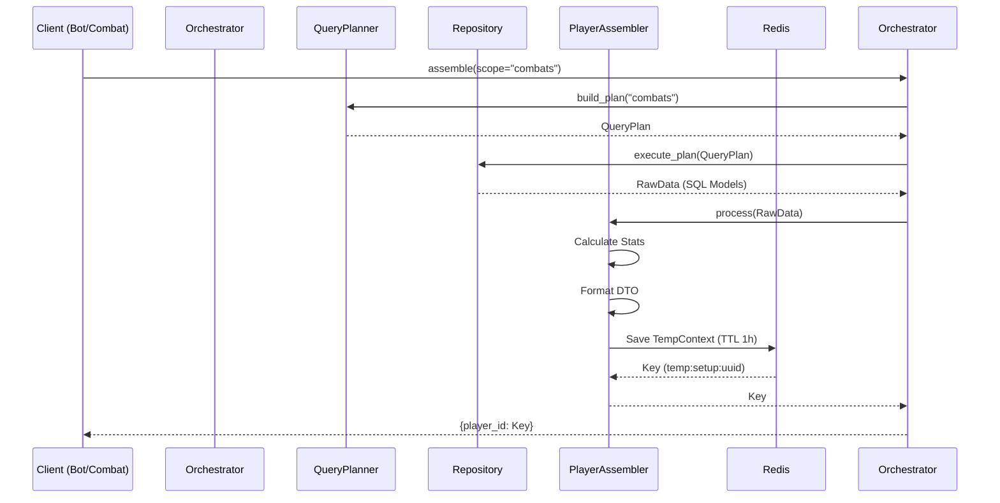

# 🔄 Data Flow

[⬅️ Назад: Concepts](README.md)

---

## 🌊 Поток данных

```mermaid
sequenceDiagram
    participant Client as Client (Bot/Combat)
    participant Orch as Orchestrator
    participant Planner as QueryPlanner
    participant Repo as Repository
    participant Assembler as PlayerAssembler
    participant Redis as Redis

    Client->>Orchestrator: assemble(scope="combats")
    Orchestrator->>Planner: build_plan("combats")
    Planner-->>Orchestrator: QueryPlan
    
    Orchestrator->>Repo: execute_plan(QueryPlan)
    Repo-->>Orchestrator: RawData (SQL Models)
    
    Orchestrator->>Assembler: process(RawData)
    Assembler->>Assembler: Calculate Stats
    Assembler->>Assembler: Format DTO
    
    Assembler->>Redis: Save TempContext (TTL 1h)
    Redis-->>Assembler: Key (temp:setup:uuid)
    
    Assembler-->>Orchestrator: Key
    Orchestrator-->>Client: {player_id: Key}
```
