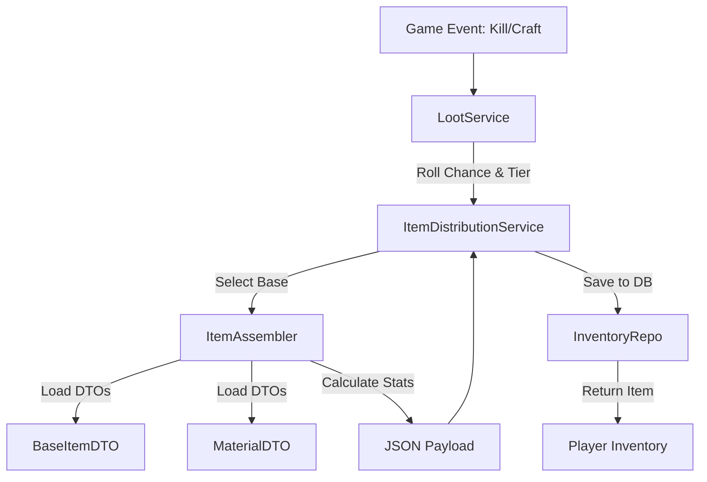

# Item Creation Pipeline (Конвейер создания предметов)

[⬅️ Назад: Item System](../README.md) | [🏠 Архитектура (Root)](../../../../README.md)

---

## 📋 Обзор
Этот документ описывает полный процесс создания игрового предмета — от выбора базы до финальной записи в БД.

**Ключевые компоненты:**
1. **ItemAssembler** — фабрика сборки предметов.
2. **ItemDistributionService** — сервис выдачи лута.
3. **LootService** — правила дропа.

---

## 🏗️ Архитектура процесса

---

## 🔧 Компонент 1: ItemAssembler

### Назначение
Превращает набор ID (base, material, bundle) в готовый JSON payload предмета.

### Метод: `assemble_equipment()`
**Вход:** `base_id`, `target_tier`, `bundle_id` (опц).
**Выход:** `item_type`, `subtype`, `rarity`, `data_payload`.

### Алгоритм сборки
1.  **Загрузка базы:** Получение `BaseItemDTO` (статы, триггеры).
2.  **Загрузка материала:** Получение `MaterialDTO` (множитель тира).
3.  **Расчёт характеристик:**
    *   `Final_Power = Base_Power * Material_Mult * Variance`
    *   `Max_Durability = Base_Durability * Material_Mult`
4.  **Применение аффиксов:**
    *   Выбор бандлов (Primary + Random).
    *   Добавление бонусов в `bonuses` и `triggers`.
5.  **Генерация имени:** "Железный меч <Vampirism>".

---

## 🎲 Компонент 2: LootService

### Назначение
Определяет, выпадает ли лут и какого качества.

### Алгоритм
1.  **Roll Drop:** Проверка шанса выпадения (с учетом удачи).
2.  **Roll Tier:** Определение тира (Хлам / Норма / Джекпот).
3.  **Делегирование:** Вызов `ItemDistributionService`.

---

## 🎁 Компонент 3: ItemDistributionService

### Назначение
Создаёт предмет и сохраняет его в БД.

### Алгоритм
1.  **Выбор базы:** Случайная база из категории.
2.  **Сборка:** Вызов `ItemAssembler`.
3.  **Сохранение:** Создание записи в `inventory_items`.
    *   *Важно:* Сначала создается у системного пользователя (SYSTEM), затем передается игроку.
4.  **Передача:** Смена `owner_id` на ID игрока.

---

## 🤖 LLM Integration (Gemini)
*Планируется.*
Генерация художественных описаний (`description`) на основе тегов предмета ("древний", "огненный", "меч").
