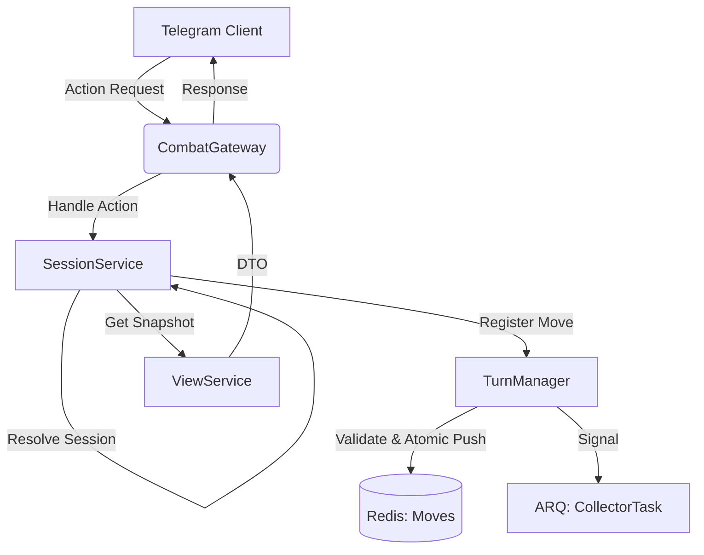

# 🚪 Combat Gateway (API)

[⬅️ Назад: Combat Domain](../README.md)

---

## 🎯 Описание
Точка входа в модуль Боя. Реализует протокол `CoreOrchestratorProtocol`.
Этот слой имитирует будущий HTTP-клиент (FastAPI).

**Принцип:** Gateway — это "тонкий" слой. Он не содержит логики боя, только валидацию и маршрутизацию в `SessionService`.

---

## 🔄 Runtime Action Flow
Диаграмма обработки запроса от клиента до записи в Redis.

---

## 📡 Методы (Entry Points)

### 1. `get_view(char_id, view_type, **kwargs)`
Универсальный метод получения данных для отображения (Read Model).

*   **Input:**
    *   `char_id` (int): ID персонажа.
    *   `view_type` (str): Тип представления (`snapshot`, `logs`).
    *   `**kwargs`: Дополнительные параметры (page, filter).
*   **Output:** `CoreResponseDTO[CombatDashboardDTO | CombatLogDTO]`.
*   **Логика:** Вызывает `SessionService.get_snapshot` или `get_logs`.

### 2. `handle_action(char_id, action_type, payload)`
Универсальный метод изменения состояния (Write Model / Intent).

*   **Input:**
    *   `char_id` (int): ID персонажа.
    *   `action_type` (str): Тип действия (`attack`, `skill`, `item`).
    *   `payload` (dict): Параметры действия (target_id, item_id).
*   **Output:** `CoreResponseDTO[CombatDashboardDTO]`.
*   **Логика:** Вызывает `SessionService.register_move`.

---

## 🔗 Интеграция (Client Side)
Клиентская реализация находится в `apps/bot/core_client/combat_rbc_client.py`.

*   **Role:** Проксирует запросы из Telegram-бота в ядро игры.
*   **Future:** В микросервисной архитектуре этот класс станет HTTP-клиентом, отправляющим запросы в FastAPI.
*   **Methods:** Зеркалирует методы Gateway (`get_view`, `handle_action`).
