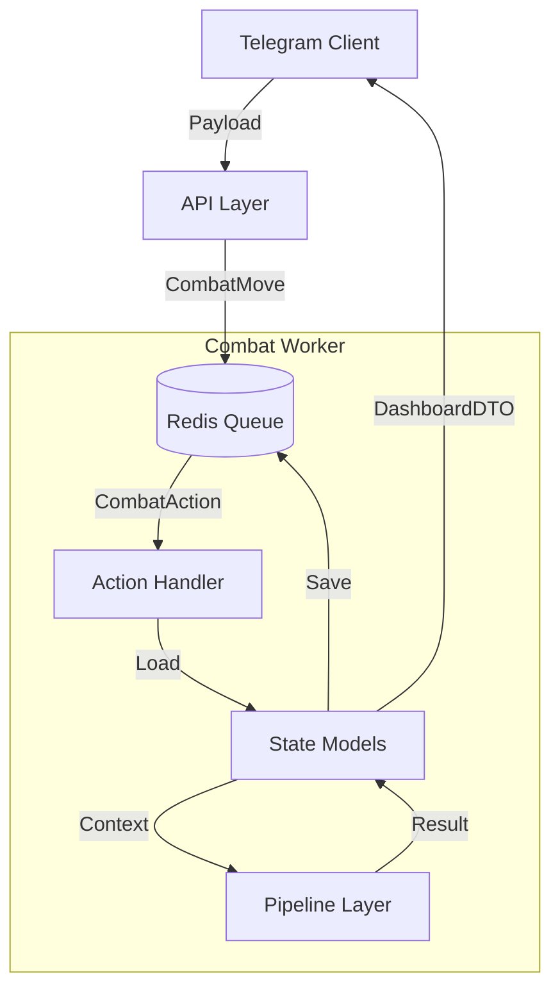

# 💾 Combat Data Layer

[⬅️ Назад: Combat Domain](../README.md)

---

## 🎯 Обзор
Слой данных (Data Layer) боевой системы RBC v3.0 отвечает за структуры данных, их хранение (Persistence) и передачу (Transport).

Мы разделяем модели данных на две категории: **State** (Состояние) и **Flow** (Поток).

## 📚 Структура документации

### 1. [State Models (Состояние)](State_Models.md)
Описывает данные, которые **хранятся** и определяют текущий статус системы.
*   **Session Layer:** `BattleContext`, `BattleMeta`, `CombatTeam`.
*   **Actor Layer:** `ActorSnapshot`, `ActorMeta`, `ActorRaw`, `ActorStats`.
*   **Persistence:** Структуры Redis JSON.

### 2. [Flow Models (Поток)](Flow_Models.md)
Описывает данные, которые **передаются** между компонентами системы во время обработки действий.
*   **API Layer:** Входящие Payloads (`Item`, `Instant`) и исходящие DTO (`Dashboard`, `Logs`).
*   **Action Layer:** Интенты (`CombatMove`) и задачи воркера (`CombatAction`).
*   **Pipeline Layer:** Контекст расчетов (`PipelineContext`, `InteractionResult`).

---

## 🔄 Data Flow Diagram (Концепт)

