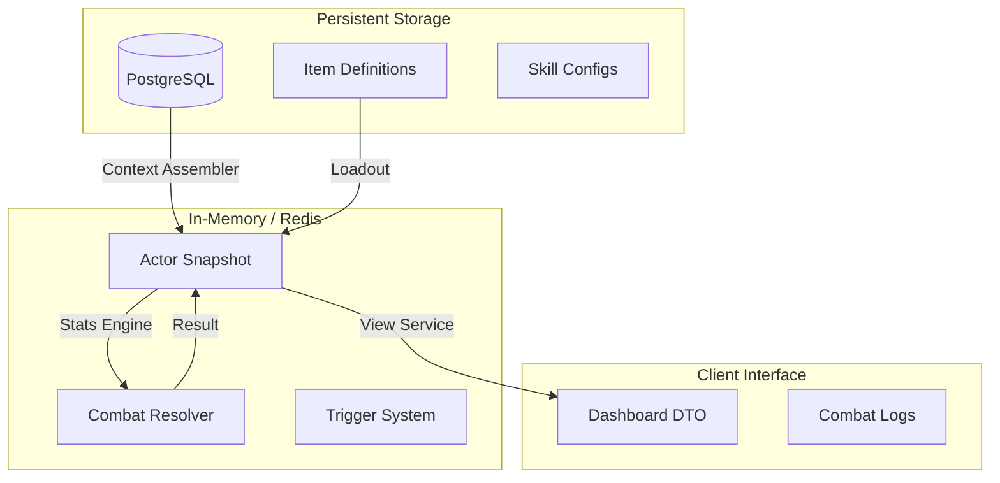

# 🔗 RPG Layer Integration

[⬅️ Назад: Engine](./README.md)

---

## 🎯 Обзор
Этот документ описывает связь между **Слоем RPG** (персонаж, инвентарь, прогрессия) и **Слоем Боя** (Combat Engine).
Боевая система RBC v3.0 изолирована от базы данных, поэтому данные должны быть трансформированы при входе и выходе.

---

## 1. Три слоя системы



---

## 2. Вход данных (RPG → Combat)

### 2.1. Оружие → Триггеры
Оружие в инвентаре превращается в набор триггеров в бою.

**RPG Layer (Item Definition):**
```python
BaseItemDTO(
    id="longsword",
    triggers=["trigger_bleed"],  # ← Определяет поведение
    implicit_bonuses={"physical_crit_chance": 0.05}
)
```

**Combat Layer (Context Builder):**
```python
# 1. Загрузка из Loadout
weapon = actor.loadout.get("main_hand")

# 2. Активация триггеров
for trigger_name in weapon.triggers:
    ctx.triggers.trigger_bleed = True

# 3. Исполнение в Резолвере
if res.is_crit and ctx.triggers.trigger_bleed:
    res.ability_flags.apply_bleed = True
```

### 2.2. Скиллы → Мутации
Скиллы могут менять формулы расчета на лету.

**RPG Layer (Ability Config):**
```python
{
    "skill_id": "devastating_strike",
    "cost": 5,
    "triggers": ["trigger_force_crit"],
    "raw_mutations": {"damage_mult": "*1.5"}
}
```

**Combat Layer (Ability Service):**
```python
# 1. Pre-Process
actor.raw.modifiers["damage_mult"]["temp"]["ability"] = "*1.5"
ctx.flags.force.crit = True

# 2. Calculation
# Урон будет умножен на 1.5 и гарантированно кританет
```

### 2.3. Атрибуты → Статы
Базовые характеристики конвертируются через Waterfall Calculator.

**RPG Layer:** `Strength: 15`
**Combat Layer:** `Physical Damage: +22.5` (по правилу `1 STR = 1.5 DMG`).

---

## 3. Выход данных (Combat → RPG)

### 3.1. XP Buffer → Прогрессия
Бой не пишет в SQL напрямую. Он накапливает события в `xp_buffer`.

**Combat Layer (Mechanics):**
```python
if result.is_crit:
    actor.xp_buffer["crit_hits"] += 1
if result.is_dodged:
    target.xp_buffer["dodge_success"] += 1
```

**RPG Layer (Post-Combat Worker):**
```python
# Reward Service
weapon_skill = actor.equipment["main_hand"].skill_class  # "skill_swords"
xp_amount = xp_buffer["crit_hits"] * 15

# Обновление в БД
character.skills[weapon_skill] += xp_amount
```

### 3.2. Эффекты → UI
Активные эффекты (баффы/дебаффы) отображаются игроку.

**Combat Layer:**
`ActiveAbilityDTO(id="bleed", duration=3)`

**UI Layer:**
`ViewService` превращает это в иконку 🩸 и описание "Кровотечение (3 хода)".

---

## 4. Связующие компоненты

### 4.1. Context Assembler
**Роль:** ETL-процесс (Extract, Transform, Load) перед боем.
1.  Загружает данные из SQL.
2.  Считает бонусы от надетой экипировки.
3.  Собирает `ActorSnapshot`.
4.  Сохраняет в Redis JSON.

### 4.2. View Service
**Роль:** Проекция данных для клиента.
1.  Читает Redis JSON.
2.  Скрывает скрытую информацию (Fog of War).
3.  Формирует `CombatDashboardDTO`.

---

## 5. Принципы Дизайна

1.  **Односторонняя зависимость:** Combat Layer ничего не знает про SQL-модели. Он работает только со своими DTO (`ActorSnapshot`).
2.  **Универсальность:** Триггеры работают одинаково для Оружия, Скиллов и Финтов. Резолверу все равно, откуда пришел флаг `trigger_bleed`.
3.  **Асинхронность:** Начисление опыта и сохранение лута происходит в фоне после боя, не блокируя геймплей.
