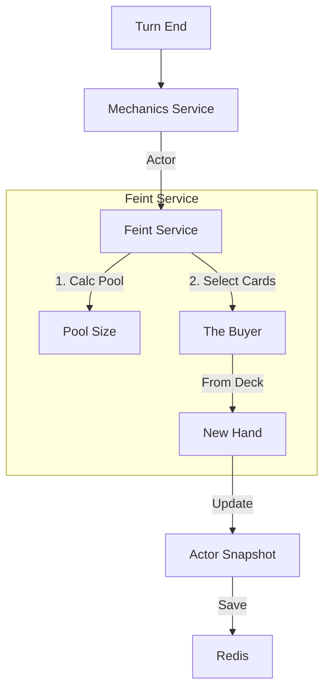

# 🃏 Feint Service (Deck & Hand Manager)

[⬅️ Назад: Logic](./README.md)

---

## 🎯 Описание
**Location:** `apps/game_core/modules/combat/combat_engine/logic/feint_service.py`
**Status:** 📝 **Design Phase**

Сервис управляет "Колодой" (Deck) и "Рукой" (Hand) персонажа.
Он реализует концепцию **Token Economy**: токены, заработанные в бою, конвертируются в доступные действия (Финты).

---

## ⚙️ Основные Механики

### 1. Deck Assembly (Сборка Колоды)
В начале боя (или при смене экипировки) сервис собирает все доступные финты.
*   **Sources:**
    *   Оружие (Weapon Triggers/Feints).
    *   Скиллы (Active Skills).
    *   Перки (Traits).
*   **Output:** `Deck` — полный список возможных действий актора.

### 2. Pool Calculation (Расчет Пула)
Определяет, сколько карт можно взять в руку на следующий ход.
*   **Formula:** `Base Pool + (Tokens / Cost Per Card)`.
*   **Tokens:** Parry Tokens, Dodge Tokens, Combo Points.
*   **Пример:** 1 Parry Token = +1 карта в руку.

### 3. The Buyer (Алгоритм Заполнения Руки)
Запускается в конце хода (Phase: Refill).
*   **Input:** `Deck`, `Pool Capacity`, `Current Hand`.
*   **Logic:**
    1.  Очищает использованные карты из руки.
    2.  Если `len(hand) < pool_capacity`:
        *   Выбирает случайные карты из `Deck` (с учетом весов/приоритетов).
        *   Добавляет в `Hand`.
*   **Output:** Обновленный список `Actor.hand`.

### 4. Card Validation (Валидация Хода)
Проверяет, имеет ли право игрок сыграть конкретную карту.
*   **Check:** Приходит `action_id` (хэш карты). Сервис ищет этот хэш в `Actor.hand`.
*   **Result:**
    *   Если есть -> `True` (и карта помечается как `pending_discard`).
    *   Если нет -> `False` (Cheat attempt or Desync).

---

## 🔄 Data Flow

---

## 🧩 Integration
*   **Mechanics Service:** Вызывает `FeintService.refill_hand()` в конце обработки хода.
*   **View Service:** Читает `Actor.hand` для отрисовки кнопок (Keyboard).
*   **Context Builder:** Получает `FeintConfig` по ID карты для настройки пайплайна.
