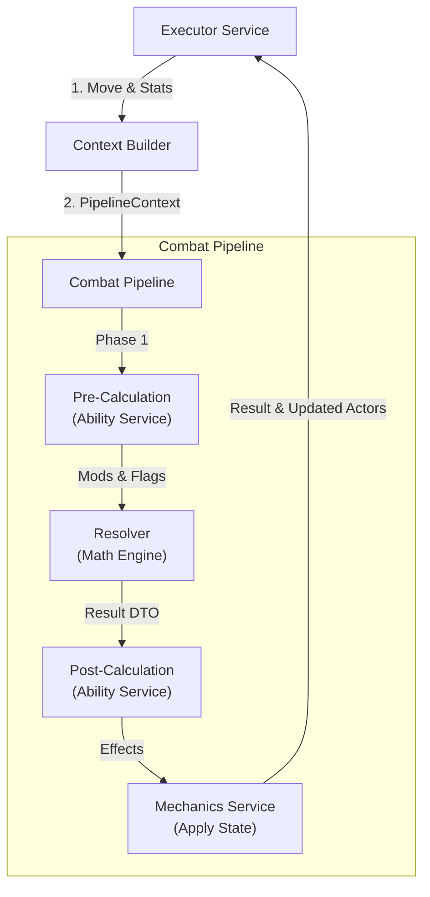

# ⚙️ Combat Pipeline Core

[⬅️ Назад: Engine](../README.md)

---

## 🎯 Концепция
**Combat Pipeline** — это механизм обработки **одного атомарного взаимодействия** (Interaction).
Он отвечает на вопрос: *"Что произойдет, если Актор А ударит Актора Б конкретным скиллом/предметом?"*

*   **Atomic:** Пайплайн не знает про "серии ударов" или "два меча". Это уровень выше (`Executor`).
*   **Stateless:** Пайплайн не хранит состояние между вызовами. Все данные приходят в `Context`.
*   **Deterministic:** При одинаковых входных данных (Stats + RNG Seed) результат всегда одинаков.

---

## 🔄 Data Flow (Поток выполнения)

---

## 1. 🏗️ Context Builder
**Role:** Подготовка "пульта управления" боем.
Собирает все флаги и модификаторы из разных источников в единый `PipelineContextDTO`.

### Источники данных:
1.  **Intent (Move):** Стратегия (`item`, `skill`, `attack`).
2.  **Source (Actor):** Пассивные навыки, экипировка (через `ActorStats`).
3.  **External Mods:** Внешние условия от `Executor` (например, "штраф за вторую руку").

### Логика сборки:
*   Определяет тип атаки (Physical, Magic).
*   Активирует триггеры оружия/скилла (записывает в `ctx.triggers`).
*   Устанавливает начальные флаги (например, `force_crit` от финта).

---

## 2. 🧮 Combat Resolver (Math Engine)
**Role:** Чистая математика. Принимает Статы и Контекст -> Возвращает Результат.
Работает пошагово. Каждый шаг может прервать вычисление (например, уворот).

### Алгоритм расчета (Resolution Steps)

#### Step 1: Accuracy (Точность)
Проверка попадания.
*   **Formula:** `Base Accuracy * Multiplier`.
*   **Check:** `RNG(0..1) < Final Accuracy`.
*   **Outcome:** Если провал -> `is_miss=True`, выход.

#### Step 2: Crit Check (Крит)
Определение критического удара.
*   **Formula:** `(Crit Chance * Skill Bonus) - Crit Anti-Chance`.
*   **Outcome:** Если успех -> `is_crit=True`.
*   **Trigger:** Вызывает событие `ON_CRIT`.

#### Step 3: Evasion (Уклонение)
Проверка защиты ловкостью.
*   **Formula:** `(Dodge Chance - Anti-Dodge)`.
*   **Modifiers:**
    *   `evasion_halved`: Шанс / 2.
    *   `ignore_evasion_cap`: Игнорировать кап уворота.
*   **Outcome:** Если успех -> `is_dodged=True`, урон = 0, выход.
*   **Counter:** Возможна активация контратаки (`check_counter_attack`).

#### Step 4: Parry (Парирование)
Проверка защиты оружием.
*   **Formula:** `Parry Chance`.
*   **Outcome:** Если успех -> `is_parried=True`.
*   **Effect:** Обычно полный блок урона, но может быть частичным (зависит от флагов).

#### Step 5: Block (Блок щитом)
Проверка защиты щитом.
*   **Formula:** `Block Chance`.
*   **Outcome:** Если успех -> `is_blocked=True`.

#### Step 6: Damage Calculation (Урон)
Финальный расчет цифр.
1.  **Base:** `Random(Min, Max)`.
2.  **Crit:** Если `is_crit` -> Умножение на `Crit Multiplier` (x1.5 или x3.0 для магии).
3.  **Mitigation (Physical):**
    *   `Mitigated % = Armor % - Penetration %`.
    *   `Final = Damage * (1 - Mitigated) - Flat Armor`.
4.  **Mitigation (Elemental):**
    *   `Mitigated % = Resistance % - Magic Penetration %`.
5.  **Pure Damage:** Игнорирует защиту.

---

## 3. 🔫 Trigger System Integration
Резолвер не хранит логику триггеров, а обращается к `GameData` (через `TRIGGER_RULES`).

**Точки вызова (Hooks):**
*   `ON_HIT` / `ON_MISS`
*   `ON_CRIT`
*   `ON_DODGE` / `ON_PARRY` / `ON_BLOCK`

**Механизм:**
1.  В точке хука Резолвер вызывает `_resolve_triggers(ctx, step="ON_CRIT")`.
2.  Проверяет, какие триггеры активны в `ctx.triggers`.
3.  Если триггер активен и прошел проверку шанса -> Применяет **Мутации**.

**Мутации (Mutations):**
*   Изменение флагов (`ctx.flags.force.hit = True`).
*   Изменение статов (`ctx.mods.damage_mult = 2.0`).
*   Заявка на эффект (`result.ability_flags.apply_bleed = True`).

---

## 4. ⚔️ Counter Attacks
Резолвер может инициировать контратаку.
*   **Условие:** Успешный Уворот или Парирование.
*   **Проверка:** `Counter Chance` (из статов защитника).
*   **Результат:** В `InteractionResult` ставится флаг `is_counter=True`.
*   **Обработка:** `Executor`, увидев этот флаг, создаст новую задачу на атаку (Defender -> Attacker).
