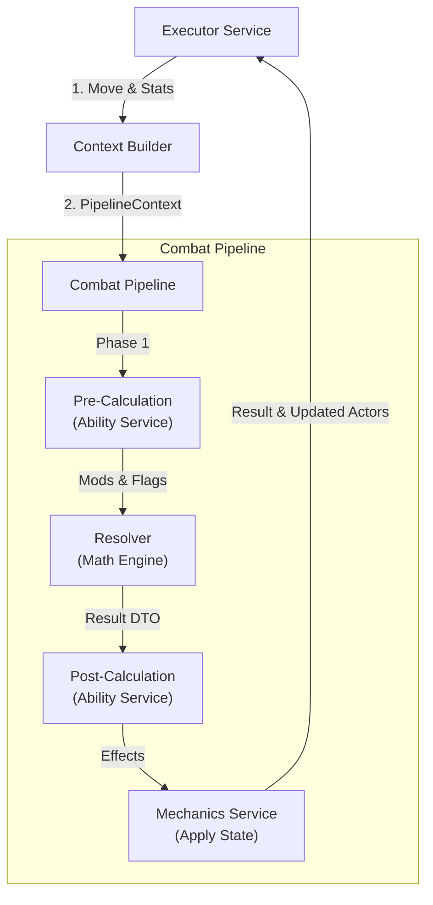

# ⚙️ Combat Pipeline Core

[⬅️ Назад: Engine](../README.md)

---

## 🎯 Концепция
**Combat Pipeline** — это механизм обработки **одного атомарного взаимодействия** (Interaction).
Он отвечает на вопрос: *"Что произойдет, если Актор А ударит Актора Б конкретным скиллом/предметом?"*

*   **Atomic:** Пайплайн не знает про "серии ударов" или "два меча". Это уровень выше (`Executor`).
*   **Stateless:** Пайплайн не хранит состояние между вызовами. Все данные приходят в `Context`.
*   **Deterministic:** При одинаковых входных данных (Stats + RNG Seed) результат всегда одинаков.

---

## 🔄 Data Flow (Поток выполнения)

---

## 1. 🏗️ Context Builder
**Role:** Подготовка "пульта управления" боем.
Собирает все флаги и модификаторы из разных источников в единый `PipelineContextDTO`.

### Источники данных:
1.  **Intent (Move):** Стратегия (`item`, `skill`, `attack`).
2.  **Source (Actor):** Пассивные навыки, экипировка (через `ActorStats`).
3.  **External Mods:** Внешние условия от `Executor` (например, "штраф за вторую руку").

### Логика сборки:
*   Определяет тип атаки (Physical, Magic).
*   Активирует триггеры оружия/скилла (записывает в `ctx.triggers`).
*   Устанавливает начальные флаги (например, `force.crit` от финта).

---

## 2. 🧮 Combat Resolver (Math Engine)
**Role:** Чистая математика. Принимает Статы и Контекст -> Возвращает Результат.
Работает пошагово. Каждый шаг может прервать вычисление (например, уворот).

### Алгоритм расчета (Resolution Steps)

#### Step 1: Accuracy (Точность)
Проверка попадания.
*   **Event:** `ON_ACCURACY_CHECK` / `ON_MISS`.
*   **Formula:** `Base Accuracy * Multiplier`.
*   **Outcome:** Если провал -> `is_miss=True`, выход.

#### Step 2: Crit Check (Крит)
Определение критического удара.
*   **Event:** `ON_CRIT` / `ON_CRIT_FAIL`.
*   **Formula:** `(Crit Chance * Skill Bonus), capped at Crit Cap`.
*   **Outcome:** Если успех -> `is_crit=True`, активируются триггеры оружия.
*   **Note:** Крит сам по себе не увеличивает урон - он запускает специальные эффекты через систему триггеров (например, кровотечение, оглушение, бонусный урон от оружия).

#### Step 3: Evasion (Уклонение)
Проверка защиты ловкостью.
*   **Event:** `ON_DODGE` / `ON_DODGE_FAIL`.
*   **Formula:** `(Dodge Chance - Anti-Dodge)`.
*   **Outcome:** Если успех -> `is_dodged=True`, ставит флаг `state.check_counter=True`, выход.

#### Step 4: Parry (Парирование)
Проверка защиты оружием.
*   **Event:** `ON_PARRY` / `ON_PARRY_FAIL`.
*   **Formula:** `Parry Chance`.
*   **Outcome:** Если успех -> `is_parried=True`, ставит флаг `state.check_counter=True` (если разрешено), выход.

#### Step 5: Block (Блок щитом)
Проверка защиты щитом.
*   **Event:** `ON_BLOCK` / `ON_BLOCK_FAIL`.
*   **Formula:** `Block Chance`.
*   **Outcome:** Если успех -> `is_blocked=True`.

#### Step 6: Counter Check (Контратака)
Проверка возможности контратаки (если был сигнал от защиты).
*   **Condition:** `state.check_counter == True`.
*   **Formula:** `Counter Chance` (+ бонусы).
*   **Outcome:** Если успех -> `is_counter=True`, `chain_events.trigger_counter=True`.

#### Step 7: Damage Calculation (Урон)
Финальный расчет цифр.
*   **Event:** `ON_DAMAGE`.
*   **Logic:** Base -> Crit Mult -> Mitigation -> Final.

#### Step 8: Finalize (Control Check)
Проверка наложения эффектов контроля.
*   **Event:** `ON_CHECK_CONTROL`.
*   **Logic:** Если атака успешна (`is_hit`), проверяем триггеры типа `stun_on_hit`.

---

## 3. 🔫 Trigger System Integration
Резолвер использует глобальную библиотеку правил `TRIGGER_RULES`.

**Механизм:**
1.  В точке хука Резолвер вызывает `_resolve_triggers(ctx, step="ON_CRIT")`.
2.  Определяет нужную секцию в `ctx.triggers` (например, `ctx.triggers.crit`).
3.  Находит активные флаги (True).
4.  Ищет правила по ID в `TRIGGER_RULES`.
5.  Если правило активно и прошло проверку шанса -> Применяет **Мутации**.

**Мутации (Mutations):**
*   Изменение флагов (`ctx.flags.force.hit = True`).
*   Изменение статов (`ctx.mods.damage_mult = 2.0`).
*   Заявка на эффект (`result.ability_flags.apply_bleed = True`).

---

## 4. ⚔️ Counter Attacks
Контратака теперь вынесена в отдельный этап `_step_counter_check`.
*   **Сигнал:** Этапы защиты (Dodge/Parry) ставят флаг `state.check_counter`.
*   **Разрешение:** Для парирования нужен перк или флаг `state.allow_counter_on_parry`.
*   **Бонус:** Флаг `formula.counter_chance_boost` дает +20%.
