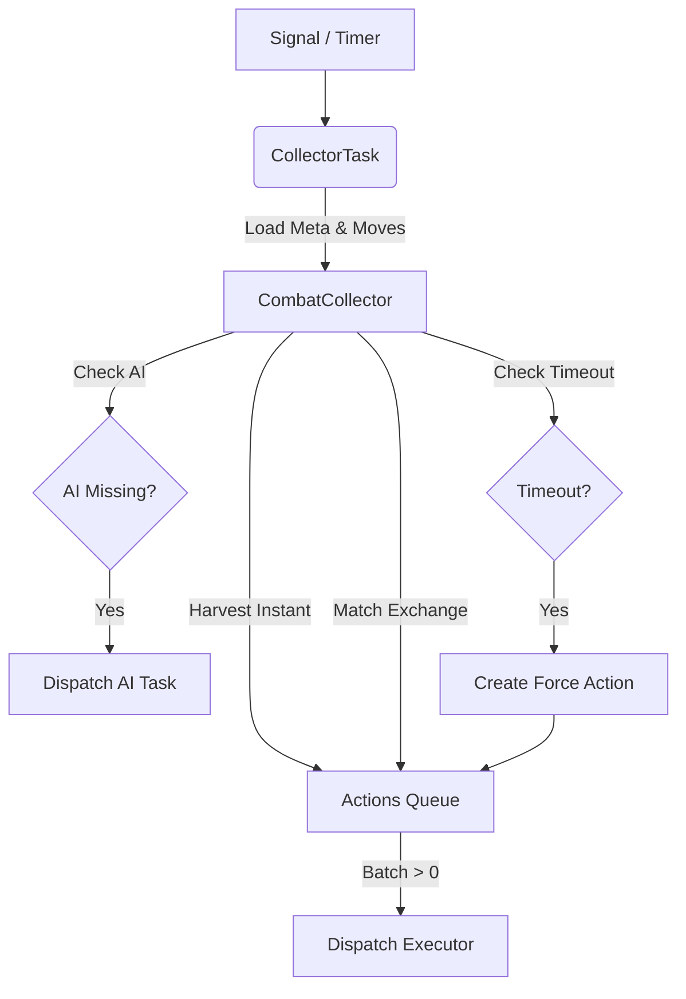

# 📥 Combat Collector

[⬅️ Назад: Processors](./README.md)

---

## 🎯 Описание
**Location:** `apps/game_core/modules/combat/combat_engine/processors/collector.py`

**Collector** — это сервис, который собирает заявки от игроков (`CombatMove`) и формирует из них пакеты для обработки (`CombatAction`).
Он решает проблему **синхронизации** в пошаговом бою (RBC).

---

## 🔄 Collector Flow (Matchmaking)
Процесс сбора заявок и формирования пар.

---

## ⚙️ Режимы работы

### 1. Immediate Mode (Мгновенные действия)
Для действий типа `item` (выпить зелье) или `instant` (быстрый скилл).
*   **Trigger:** Поступление заявки.
*   **Action:** Сразу создает задачу для Executor'а.
*   **Queue:** Приоритетная очередь.

### 2. Exchange Mode (Размен ударами)
Для действий типа `attack` (основной бой).
*   **Logic:** Ждет, пока **оба** участника (Атакующий и Цель) сделают ход.
*   **Timeout:** Если второй участник не отвечает в течение N секунд -> принудительный пропуск хода (AFK).
*   **Pairing:** Находит пару заявок (Move A -> B и Move B -> A) и объединяет их в один `CombatAction(exchange)`.

---

## 🔄 ARQ Integration
Collector работает как фоновый процесс (или вызывается по триггеру из ARQ).
*   Слушает очередь `arq:combat_collector`.
*   Проверяет таймауты ("Кто не походил?").
*   Генерирует события для AI (если бот должен походить).
