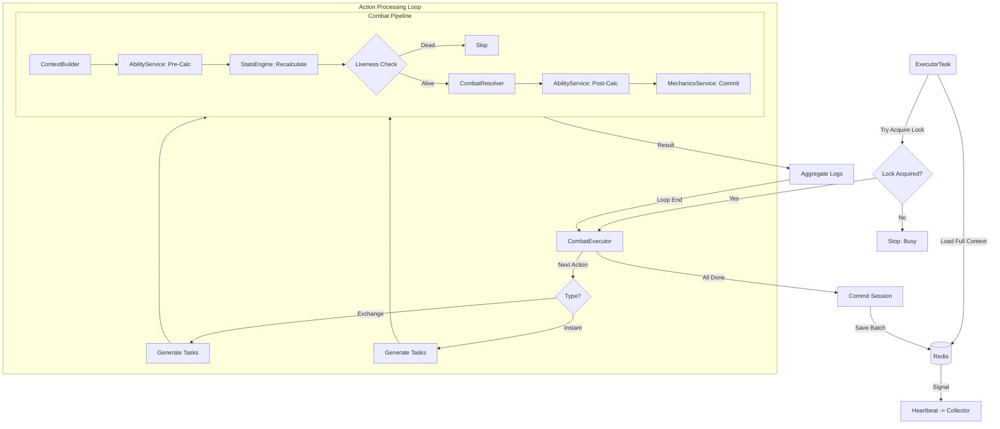

# ⚡ Combat Executor

[⬅️ Назад: Processors](./README.md)

---

## 🎯 Описание
**Location:** `apps/game_core/modules/combat/combat_engine/processors/executor.py`

**Executor** — это "дирижер" боевого раунда. Он получает задачу на действие (`CombatAction`) и превращает её в серию вызовов Пайплайна.
Именно здесь реализуется логика **Dual Wield** (два оружия), **Multi-Hit** (серии ударов) и **AOE**.

---

## 🔄 Executor Flow (Processing Loop)
Цикл обработки батча действий.

---

## ⚙️ Алгоритм Работы

### 1. Analysis (Планирование)
Перед запуском Executor анализирует экипировку и интент.
*   **Dual Wield Check:** Если у игрока два оружия, Executor запланирует **два** прогона пайплайна (Main Hand + Off Hand).
*   **AOE Check:** Если цель — "все враги", Executor создаст список пар (Source -> Enemy1, Source -> Enemy2...).

### 2. Execution Loop (Цикл исполнения)
Для каждой запланированной пары (Source -> Target):

1.  **Stats Update:** Актуализирует статы (`StatsEngine.ensure_stats`).
2.  **Pipeline Call:** Вызывает `CombatPipeline.calculate()`.
3.  **Result Handling:**
    *   Получает `InteractionResult`.
    *   Если была контратака (`is_counter`), добавляет новую задачу в очередь "мгновенных действий".
4.  **Log Generation:** Формирует запись для лога боя.

### 3. Finalization
*   Проверяет смерть участников.
*   Сохраняет изменения в Redis (через `CombatDataService`).
*   Отправляет события (Events) во внешние системы (если нужно).

---

## 🔄 Обработка Контратак
Если Пайплайн вернул флаг `is_counter=True`:
1.  Executor **не** запускает контратаку мгновенно внутри того же цикла (чтобы избежать рекурсии).
2.  Вместо этого он создает новую задачу `CombatAction(type="forced", ...)` и кладет её в начало очереди обработки.
