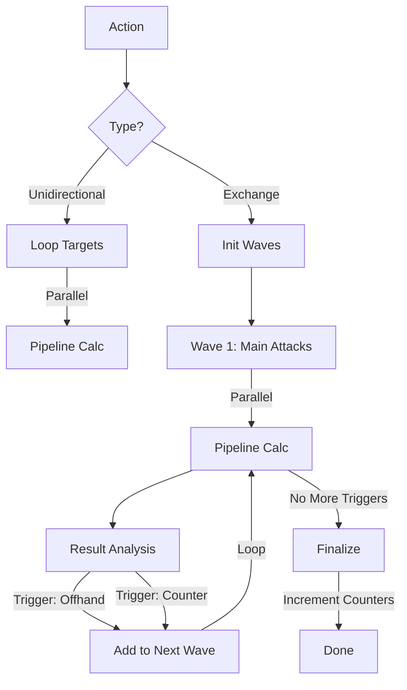

# ⚡ Combat Executor

[⬅️ Назад: Processors](./README.md)

---

## 🎯 Описание
**Location:** `apps/game_core/modules/combat/combat_engine/processors/executor.py`

**Executor** — это "дирижер" боевого раунда. Он получает задачу на действие (`CombatAction`) и превращает её в серию вызовов Пайплайна.
Он реализует концепцию **"Всё в одной задаче"**: весь каскад ударов (атака, вторая рука, контратака) обрабатывается внутри одного вызова `process_batch`, обеспечивая атомарность размена.

---

## 🏗️ Class Structure (API)

### Public Methods

#### `process_batch(ctx: BattleContext, actions: list[CombatActionDTO]) -> list[str]`
Главная точка входа. Обрабатывает пакет действий последовательно.
*   **ctx:** Контекст боя (изменяется in-place).
*   **actions:** Список действий для обработки.
*   **Returns:** Список ID успешно обработанных действий (`move_id`).

---

### Private Methods (Internal Logic)

#### `_process_single_action(ctx, action) -> None`
Маршрутизатор. Определяет тип действия и вызывает соответствующий обработчик.
*   Если `exchange` -> `_handle_exchange`.
*   Если `instant/item` -> `_handle_unidirectional`.

#### `_handle_exchange(ctx, action) -> None`
**Core Logic.** Обрабатывает дуэль (размен ударами).
*   Запускает цикл **Waves (Волн)**.
*   Обрабатывает триггеры (Chain Reactions) из результатов Pipeline.
*   Инкрементит глобальные счетчики (`step_counter`, `exchange_counter`).

#### `_handle_unidirectional(ctx, action) -> None`
Обрабатывает односторонние действия (хил, бафф, AOE).
*   Поддерживает мульти-таргет (список `target_ids`).
*   **Не** инкрементит счетчики боя.

#### `_create_task(source, target, move, mods=None)`
Хелпер для создания задачи Pipeline.
*   Инкапсулирует вызов `pipeline.calculate`.
*   Прокидывает `exchange_count` и внешние модификаторы (`mods`).

---

## 🔄 Executor Flow (Processing Loop)

---

## ⚙️ Алгоритм Работы

### 1. Exchange Mode (Размен)
Обработка дуэли между двумя участниками (A и B). Использует механизм **Waves (Волн)** для поддержки цепных реакций.

#### Wave 1: Initial Clash
*   Создается задача **A -> B** (Main Hand).
*   Если есть `partner_move`, создается задача **B -> A** (Main Hand).
*   Задачи выполняются параллельно через `asyncio.gather`.

#### Wave 2+: Chain Reactions
Executor анализирует результаты первой волны на наличие **Триггеров** (в `InteractionResultDTO.chain_events`):
1.  **Off-Hand Attack:** Если Pipeline решил, что нужно ударить второй рукой -> добавляется задача `A -> B (Off Hand)`.
2.  **Counter-Attack:** Если сработал триггер контратаки (например, после уклонения) -> добавляется задача `B -> A (Counter)`.
3.  **Extra Strike:** Если сработал перк на двойной удар.

Цикл повторяется до тех пор, пока есть новые задачи (с лимитом `MAX_WAVES = 3` для защиты от зацикливания).

#### Finalization
*   Инкрементируются счетчики `exchange_counter` (для участников) и `step_counter` (глобальный).
*   Логируется завершение размена.

### 2. Unidirectional Mode (Одностороннее)
Для действий типа `item`, `instant` или `cast`.
*   Executor получает список целей (`target_ids`).
*   Создает задачу для **каждой** цели (AOE).
*   Выполняет их параллельно.
*   **Важно:** В этом режиме счетчики (`exchange_counter`) **не** инкрементируются.

---

## 📊 Data Flow
1.  **Input:** `BattleContext` (Mutable) + `CombatActionDTO`.
2.  **Process:** Мутация контекста внутри Pipeline (HP, Tokens).
3.  **Output:** Список ID обработанных действий (`processed_ids`).
