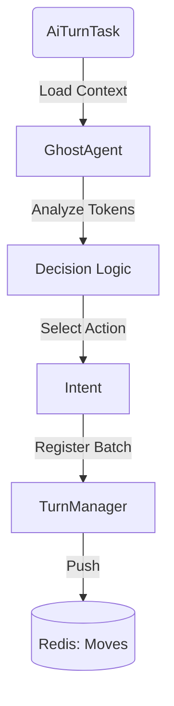

# 👷 Combat Workers (ARQ Tasks)

[⬅️ Назад: Engine](../README.md)

---

## 🎯 Описание
**Location:** `apps/game_core/modules/combat/combat_engine/workers/tasks/`

Этот слой отвечает за **асинхронное выполнение** логики движка.
Задачи (Tasks) запускаются через `arq` (Redis Queue) и управляют жизненным циклом процессоров (`Executor`, `Collector`).

---

## 1. ⚡ Executor Task
**File:** `executor_task.py`
**Queue:** `q:actions` (читает из Redis List, запускается по триггеру)

Главная задача по расчету боя. Реализует паттерн **Safe Execution** с защитой от гонок (Race Conditions).

### Алгоритм (Lifecycle)
1.  **Load Context:** Загружает полный контекст боя (`BattleContext`) через `DataService`.
2.  **Lock Acquisition:**
    *   Пытается захватить **Busy Lock** (`combat:rbc:{sid}:sys:busy`).
    *   Если занято -> выход (другой воркер уже работает).
3.  **Fetch Actions:** Читает пачку действий (`LPOP`) из очереди `q:actions`.
4.  **Process:** Передает действия в `CombatExecutor` для расчета.
5.  **Zombie Check (Critical):**
    *   Перед сохранением проверяет, владеет ли он все еще локом.
    *   Если лок истек (воркер завис) -> **Abort** (не сохраняет, чтобы не испортить данные).
6.  **Commit:** Сохраняет изменения в Redis.
7.  **Release & Signal:** Снимает лок и отправляет `heartbeat` коллектору.

---

## 2. 📥 Collector Task
**File:** `collector_task.py`
**Queue:** `arq:combat_collector`

Задача-оркестратор. Реагирует на сигналы (`CollectorSignalDTO`).

### Типы Сигналов
*   **`check_immediate`:** Пришла заявка на мгновенное действие (зелье). Запускает Executor.
*   **`check_timeout`:** Проверка таймеров (AFK). Если время вышло -> Force Skip.
*   **`heartbeat`:** Сигнал от Executor'а "Я закончил". Коллектор проверяет, есть ли еще задачи.

---

## 3. 🤖 AI Turn Task
**File:** `ai_turn_task.py`
**Queue:** `arq:combat_ai`

Задача для хода NPC/Мобов.

*   **Trigger:** Вызывается Коллектором, когда наступает очередь бота.
*   **Logic:**
    1.  Загружает `AIProcessor`.
    2.  Выбирает действие (Attack/Heal).
    3.  Регистрирует ход через `CombatManager` (как обычный игрок).

---

## 4. 🌀 Chaos Task
**File:** `chaos_task.py`
**Queue:** `arq:default`

Фоновая задача обслуживания.
*   **Cleanup:** Удаляет "мертвые" сессии (где все вышли).
*   **Stuck Check:** Сбрасывает зависшие локи.
*   **Resend:** Переотправляет потерянные сообщения.
