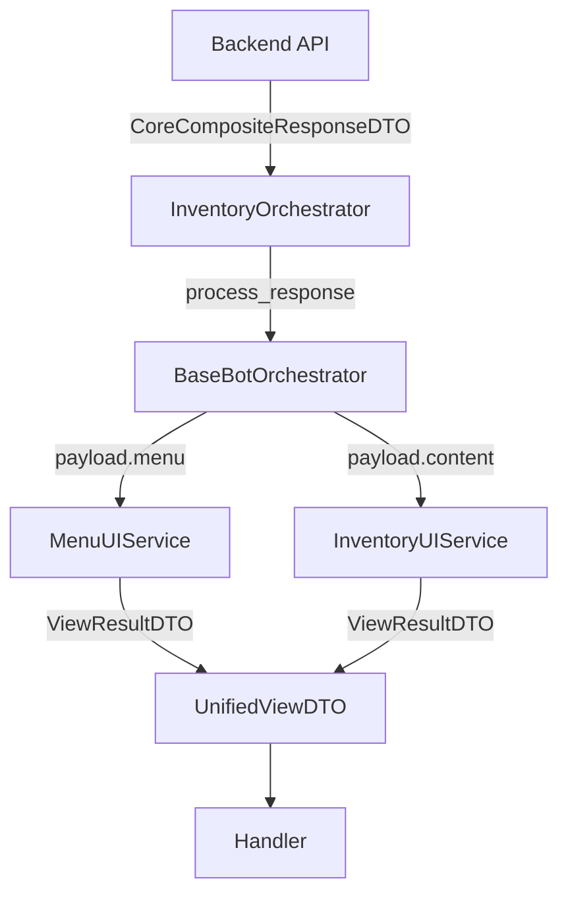

# 🎻 Inventory Bot Orchestrator

[⬅️ Назад: Telegram Client](./README.md)

---

## ⚠️ Prerequisites (Требования к Ядру)
Для работы этого оркестратора требуется расширение `BaseBotOrchestrator`.
Подробное описание базовых классов и их контрактов см. в **[Client Base Classes](../../../../../Shared_Kernel/Client_Base.md)**.

**Необходимо добавить в BaseBotOrchestrator:**
1.  Поддержку `CoreCompositeResponseDTO`.
2.  Метод `_process_composite_response(response)`.
3.  Абстрактный метод `render_content(payload)`, который должны реализовать наследники.

---

## 🎯 Описание
Координатор клиентской логики.
Связывает API Client, UI Service и базовую логику обработки ответов (Composite Response).

**Расположение:** `features/inventory/system/inventory_bot_orchestrator.py`
**Наследование:** `BaseBotOrchestrator` (см. [Client Base](../../../../../Shared_Kernel/Client_Base.md))

---

## 🛠️ Методы

### 1. `handle_view_request(cb: InventoryViewCB) -> UnifiedViewDTO`
Обрабатывает запрос навигации.

**Алгоритм:**
1.  Получает `char_id` через `self.director.get_char_id()`.
2.  Вызывает API: `client.get_view(char_id, cb.target, **cb.payload)`.
3.  Получает `CoreResponseDTO` (или `CoreCompositeResponseDTO`).
4.  Вызывает базовый метод `self.process_response(response)`.
    *   Базовый метод сам разберется:
        *   Если это Редирект -> `director.process_transition`.
        *   Если это Композит -> Рендерит Меню + Контент.
        *   Если это Ошибка -> Рендерит Alert.
5.  Для рендеринга Контента базовый метод вызовет `self.render_content(payload)`.

### 2. `handle_action_request(cb: InventoryActionCB) -> UnifiedViewDTO`
Обрабатывает действие.

**Алгоритм:**
1.  Получает `char_id`.
2.  Вызывает API: `client.execute_action(...)`.
3.  Вызывает `self.process_response(response)`.

---

## 🎨 Render Content (Implementation)

Реализация абстрактного метода базового класса.

```python
def render_content(self, payload: Any) -> ViewResultDTO:
    # Проверяем тип payload (InventoryUIPayloadDTO)
    if isinstance(payload, dict):
        dto = InventoryUIPayloadDTO(**payload)
    else:
        dto = payload
        
    return self.ui_service.render(dto)
```

---

## 🔄 Composite Response Flow


