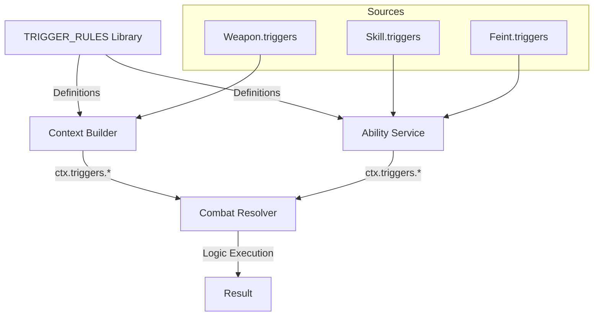

# Feature: Trigger & Flag System

⬅️ [Назад](../../README.md) | 🏠 [Документация](../../../../../README.md)

## 1. Overview
Система триггеров и флагов — это механизм управления пайплайном боя. Она позволяет динамически менять правила расчета (формулы, проверки) и накладывать эффекты, не переписывая код калькулятора.

Ключевая идея: **Разделение ответственности**.
*   **Pipeline Builder** собирает начальные флаги из интента и пассивок.
*   **Ability Service** интерпретирует "сложные" триггеры (эффекты, статусы) и модифицирует флаги.
*   **Combat Calculator** исполняет математику на основе финальных флагов.

## 1.5. Philosophy: Universal Trigger Mechanism

### Ключевая идея
Триггеры — это **УНИВЕРСАЛЬНАЯ** система для всех источников эффектов:
- Оружие (weapon triggers)
- Финты (feint triggers)
- Скиллы (ability triggers)
- Стойки (stance triggers)

**Все используют ОДНУ библиотеку** `TRIGGER_RULES` и **ОДНУ логику** обработки в `CombatResolver._resolve_triggers()`.

### Разница только в источнике активации

| Источник | Где активируется | Когда проверяется |
|----------|------------------|-------------------|
| **Weapon** | `ContextBuilder` (из `weapon.triggers`) | `ON_CRIT` / `ON_HIT` |
| **Ability** | `AbilityService.pre_process()` (из `skill.triggers`) | Любое событие |
| **Feint** | `AbilityService.pre_process()` (из `feint.triggers`) | Любое событие |

### Data Flow


### Пример: Одинаковая обработка

**Меч (weapon):**
```python
BaseItemDTO(
    id="longsword",
    triggers=["trigger_bleed"]  # Активируется Context Builder
)
```

**Финт (ability):**
```python
{
    "feint_id": "bleeding_strike",
    "triggers": ["trigger_bleed"]  # Активируется Ability Service
}
```

**Резолвер:**
```python
# Оба триггера обрабатываются ОДИНАКОВО
if ctx.triggers.trigger_bleed:
    res.ability_flags.apply_bleed = True
```

---

## 2. Типы Флагов (Flag Taxonomy)

Флаги передаются в словаре `context.flags`.

### A. Control Flags (Управление потоком)
Включают или выключают целые блоки кода в калькуляторе.
*   `check_evasion` (bool): Если False, фаза проверки уворота пропускается (авто-попадание).
*   `check_crit` (bool): Если False, крит невозможен.
*   `check_block` (bool): Если False, щит игнорируется.

### B. Force Flags (Принудительные состояния)
Переписывают результат проверки, даже если она была включена.
*   `force_hit` (bool): Игнорировать результат броска на точность (всегда попал).
*   `force_crit` (bool): Игнорировать шанс крита (всегда крит).
*   `force_miss` (bool): Принудительный промах (например, при ослеплении).

### C. Trigger Flags (Модификаторы логики)
Самая сложная категория. Триггеры могут быть:
1.  **Formula Triggers:** Меняют математическую формулу.
    *   Пример: `trigger_crit_power` -> использовать формулу `CritDmg * 2.5` вместо `* 1.5`.
2.  **Effect Triggers:** Сигнал для Ability Service наложить эффект.
    *   Пример: `TRIGGER_BLEED_ON_HIT`.

---

## 3. Pipeline Flow (Как это работает)

### Phase 1: Pipeline Builder (Context Assembly)
В начале размена (Exchange) создается контекст.
*   **Input:** Intent (Финт "Head Attack"), Actor Stats (Passive "Sword Mastery").
*   **Process:**
    *   Финт имеет конфиг: `{"flags": {"force_crit": True, "trigger": "BLEED_ON_HIT"}}`.
    *   Пассивка имеет конфиг: `{"flags": {"check_evasion": False}}` (Нельзя увернуться).
*   **Output:** `initial_flags = {"force_crit": True, "trigger": "BLEED_ON_HIT", "check_evasion": False}`.

### Phase 2: Ability Service (Pre-Calculation)
Сервис сканирует `initial_flags` на наличие известных ему триггеров.
*   **Input:** `initial_flags`.
*   **Logic:**
    *   Видит `BLEED_ON_HIT`.
    *   Понимает: "Это моя работа. Но наложить эффект нужно *только если* будет попадание".
    *   Действие: Регистрирует отложенный коллбек (Post-Calc Hook).
    *   *Note:* Сам флаг `BLEED_ON_HIT` из контекста калькулятора можно убрать, чтобы не мусорить, или оставить (калькулятор его все равно проигнорирует).

### Phase 3: Combat Calculator (Execution)
Считает цифры.
*   Видит `check_evasion: False` -> Пропускает `roll_evasion()`.
*   Видит `force_crit: True` -> Ставит `is_crit = True`.
*   **Output:** `ResultDTO(is_hit=True, is_crit=True, damage=150)`.

### Phase 4: Ability Service (Post-Calculation)
Срабатывают хуки.
*   **Check:** Был ли `is_hit` в ResultDTO? Да.
*   **Action:** Накладывает эффект `Bleeding` на цель.

---

## 4. Пример: "Critical Bleed" (Разбор кейса)

Финт `swords` имеет триггер `CRITICAL_BLEED`.

1.  **Builder** разворачивает это в:
    ```python
    flags = {
        "force_crit": True,       # Часть "Critical"
        "trigger_bleed": True     # Часть "Bleed"
    }
    ```
2.  **Ability Service (Pre)**:
    *   Видит `trigger_bleed`.
    *   Готовит DTO эффекта: `{type: "dot", name: "bleeding", power: 10}`.
    *   Подписывается на событие `on_hit`.
3.  **Calculator**:
    *   Видит `force_crit`. Считает крит-урон.
    *   Возвращает `is_hit=True`.
4.  **Ability Service (Post)**:
    *   Видит `is_hit`.
    *   Применяет `bleeding` к цели.

## 5. Хранение Триггеров
*   **Базовые флаги (Control/Force):** Хардкод в `CombatCalculator` (он их проверяет `if flags.get('force_crit')`).
*   **Эффект-триггеры:** Словарь в `AbilityService`.
    ```python
    # AbilityService Config
    KNOWN_TRIGGERS = {
        "TRIGGER_BLEED": BleedEffectFactory,
        "TRIGGER_STUN": StunEffectFactory,
        "TRIGGER_VAMPIRISM": VampirismLogic
    }
    ```
