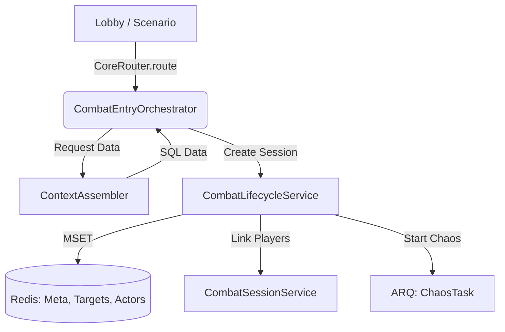
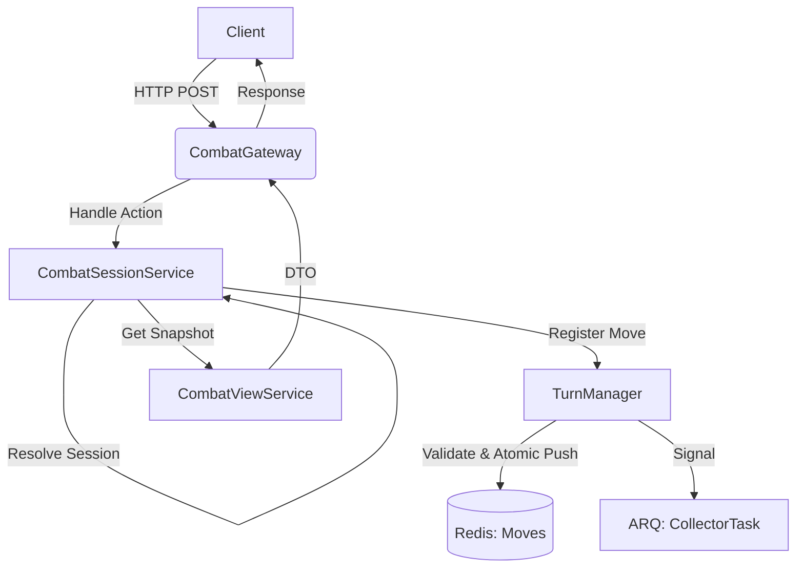
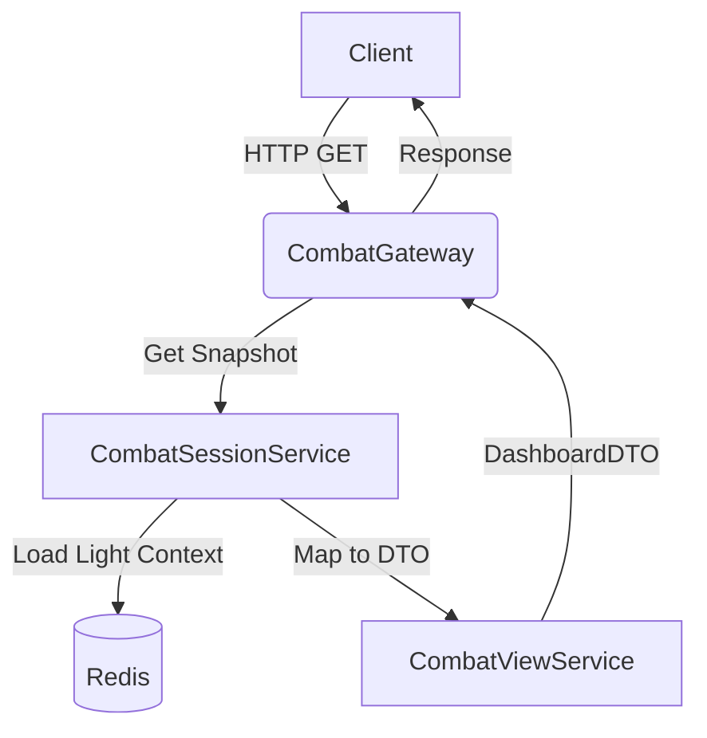

# API Flows (Synchronous Layer)

⬅️ [Назад](../README.md) | 🏠 [Документация](../../../../README.md)

В этом документе описаны синхронные потоки данных: от запроса (внутреннего или внешнего) до записи в Redis.

---

## 1. Initialization Flow (Internal)
**Цель:** Создание новой боевой сессии.
**Trigger:** Лобби, Сценарий или Матчмейкер (через `CoreRouter`).

### Компоненты
*   [**CombatEntryOrchestrator**](../components/initialization.md) — Точка входа. Выбирает сценарий (PvE, PvP).
*   [**CombatLifecycleService**](../components/lifecycle_service.md) — Строитель сессии. Создает структуры данных.
*   [**CombatSessionService**](../components/data_layer/combat_session_service.md) — Связывает игроков с сессией.

---

## 2. Runtime Action Flow (External)
**Цель:** Игрок совершает действие (Атака, Скилл).
**Trigger:** FastAPI (Telegram Bot WebApp).

### Компоненты
*   [**CombatGateway**](../components/ingress_api.md) — API Wrapper.
*   [**CombatSessionService**](../components/data_layer/combat_session_service.md) — Фасад. Скрывает работу с сессиями.
*   [**TurnManager**](../components/turn_manager.md) — Валидатор и отправитель сигналов.
*   [**CombatViewService**](../components/view_service.md) — Презентер. Собирает DTO для ответа.

---

## 3. Runtime View Flow (External)
**Цель:** Игрок запрашивает состояние экрана (Polling / Refresh).
**Trigger:** FastAPI.

