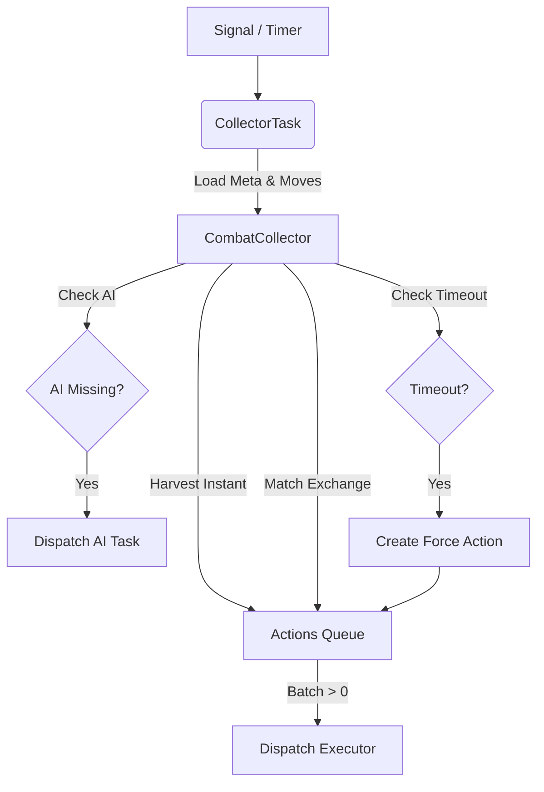
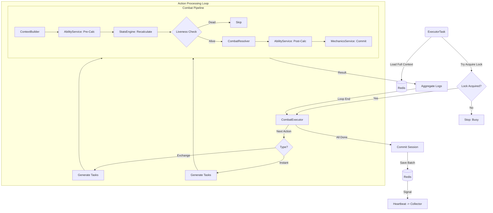
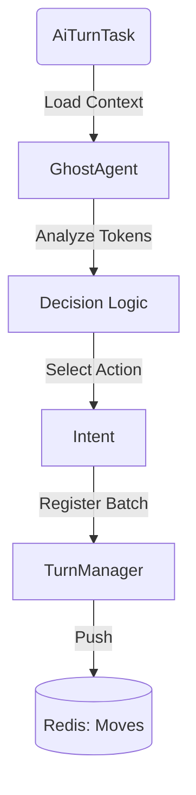

# Worker Flows (Asynchronous Layer)

⬅️ [Назад](../README.md) | 🏠 [Документация](../../../../README.md)

В этом документе описаны асинхронные процессы, происходящие в фоне (ARQ Workers).

---

## 1. Collector Flow (Matchmaking)
**Цель:** Сбор заявок, поиск пар и запуск исполнителей.
**Trigger:** Сигнал от `TurnManager` или Таймер.

---

## 2. Executor Flow (Processing Loop)
**Цель:** Расчет физики боя и применение изменений.
**Trigger:** Задача от `Collector`.

---

## 3. AI Flow (Bot Logic)
**Цель:** Принятие решения за NPC.
**Trigger:** Задача от `Collector`.

