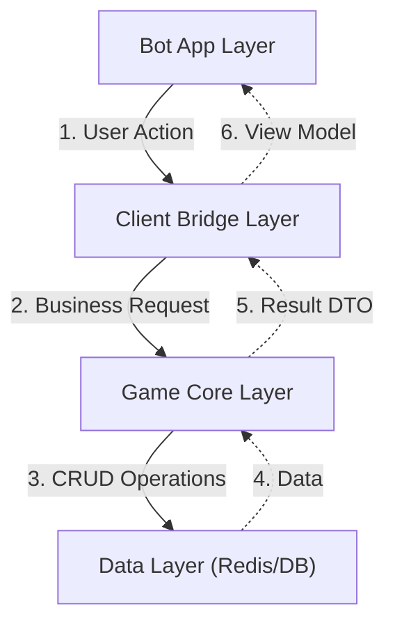
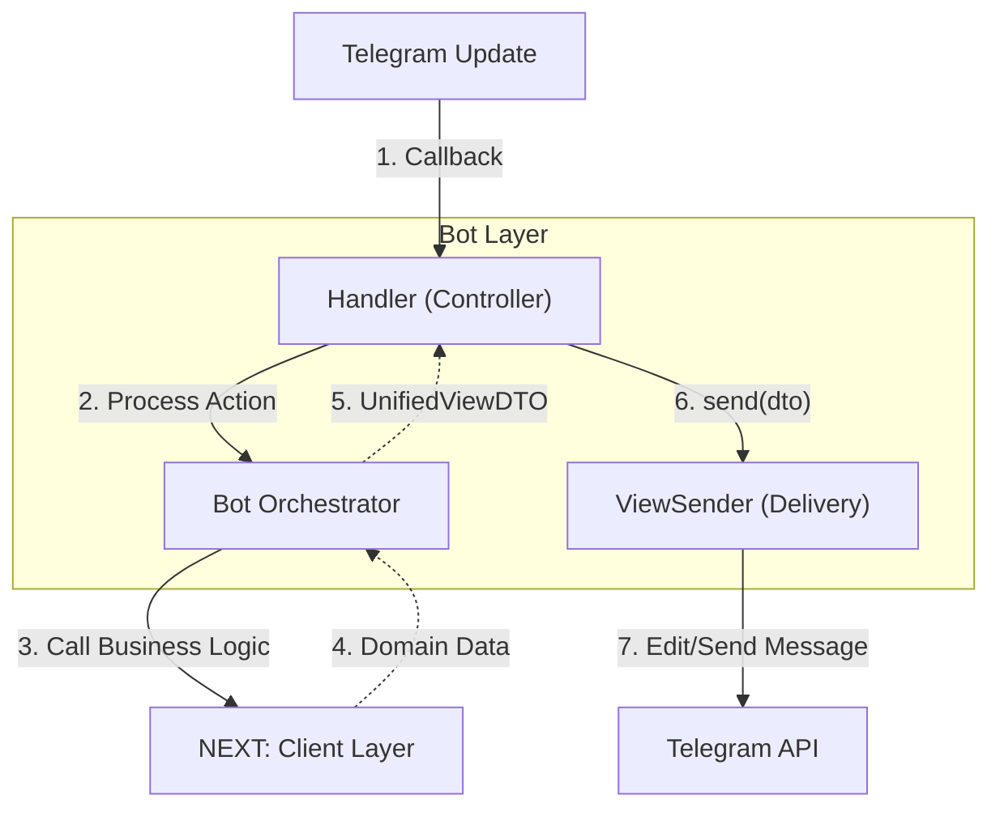
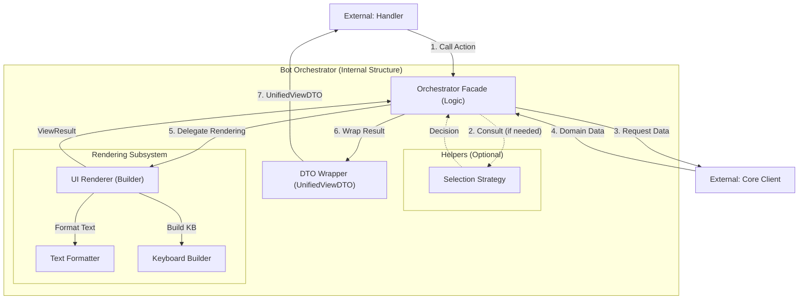
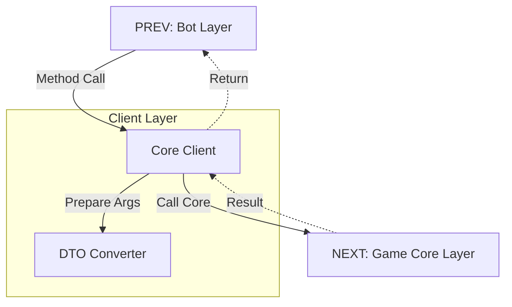
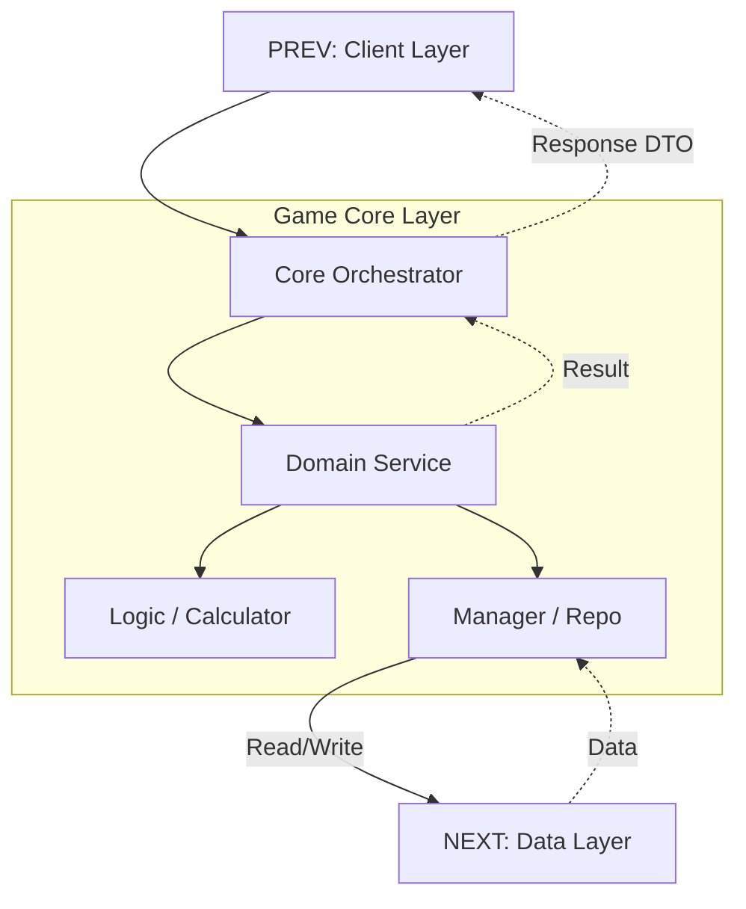
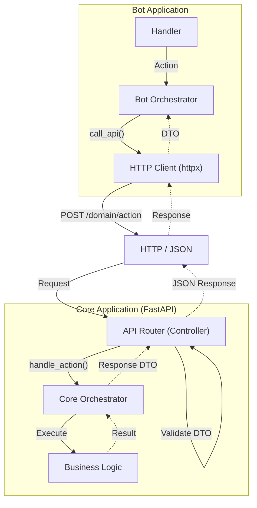

# Architecture Overview

## 1. The Big Picture (Global Flow)
Общая схема взаимодействия слоев. Каждый слой изолирован и общается только с соседями.

---

## 2. Layer Details (Current Monolith)

### 2.1. Bot Layer (Presentation)
Отвечает за Telegram API, FSM и доставку контента. Реализует паттерн Passive View.

### 2.1.1. Bot Orchestrator Internals (UI Brain)
Оркестратор — это не просто "прокси". Это центр принятия решений UI-слоя. Он изолирует Хендлер от сложности выбора данных и форматирования.

**Алгоритм работы метода (Pipeline):**

1.  **Resolution (Выбор стратегии):**
    *   Если запрос простой — Оркестратор сам знает, какой метод Клиента вызвать.
    *   Если запрос сложный (зависит от контекста, фильтров или состояния) — Оркестратор делегирует выбор `LogicHelper`.

2.  **Data Fetching (Запрос данных):**
    *   Оркестратор вызывает `Core Client` для получения "сырых" бизнес-данных (Domain DTO).

3.  **Rendering (Визуализация):**
    *   Оркестратор вызывает `UIService` (Renderer), передавая ему бизнес-данные.
    *   `UIService` строит тексты и клавиатуры, возвращая `ViewResult`.

4.  **Packaging (Сборка):**
    *   Оркестратор упаковывает результат в `UnifiedViewDTO` (распределяет по слотам Menu/Content) и возвращает Хендлеру.

### 2.2. Client Layer (The Bridge)
Изолирует Бот от Ядра. Скрывает сложность DI и преобразует данные.

### 2.3. Game Core Layer (Business Logic)
Чистая бизнес-логика. Правила игры, расчеты, управление состоянием.

---

## 3. Target Architecture (HTTP API Microservices)
Целевая архитектура при разделении на микросервисы (Bot + Core API).

