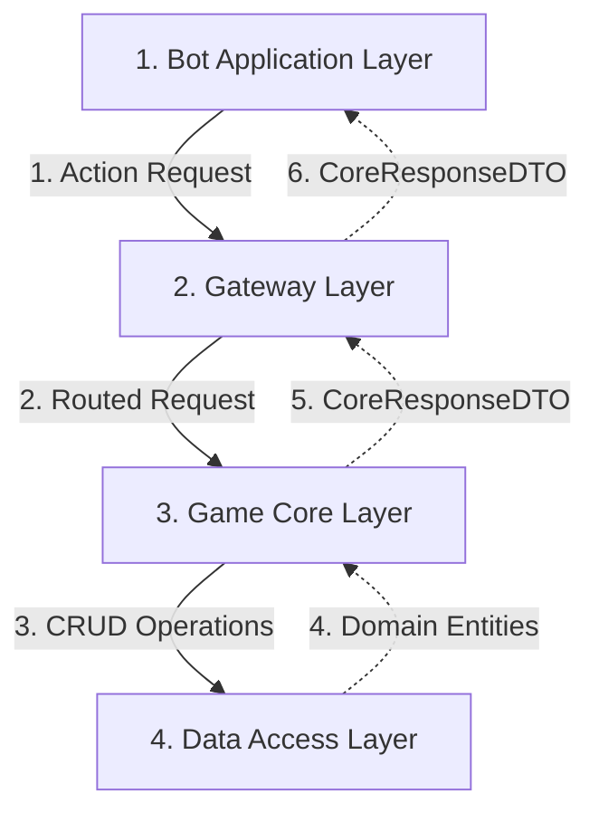
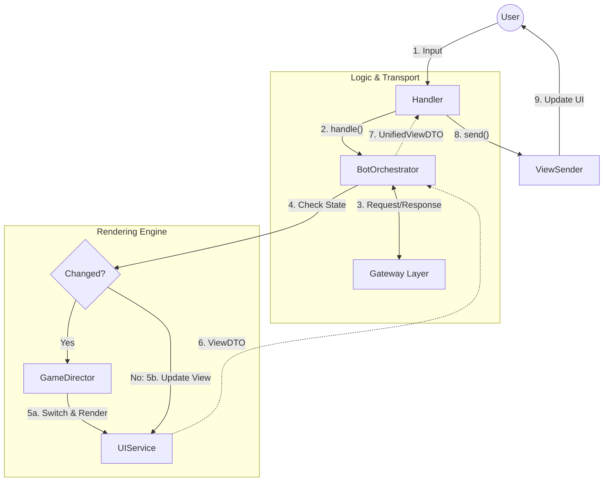
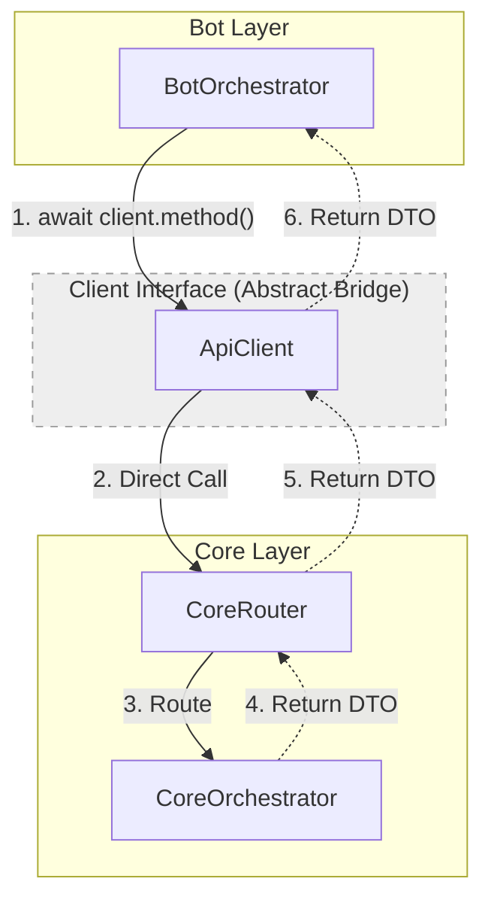
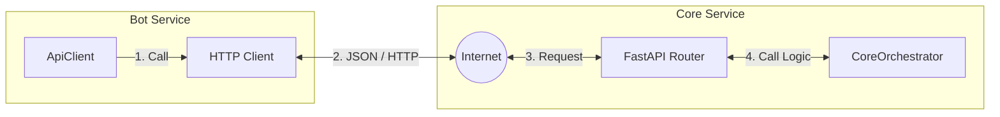
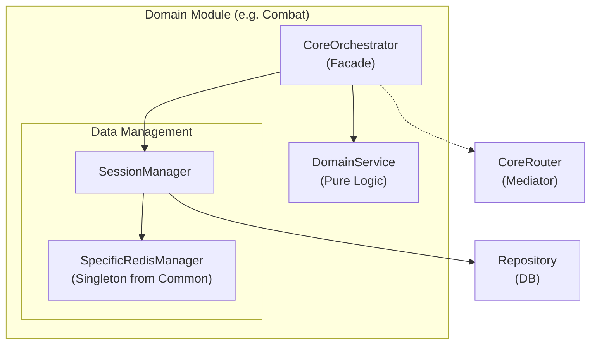
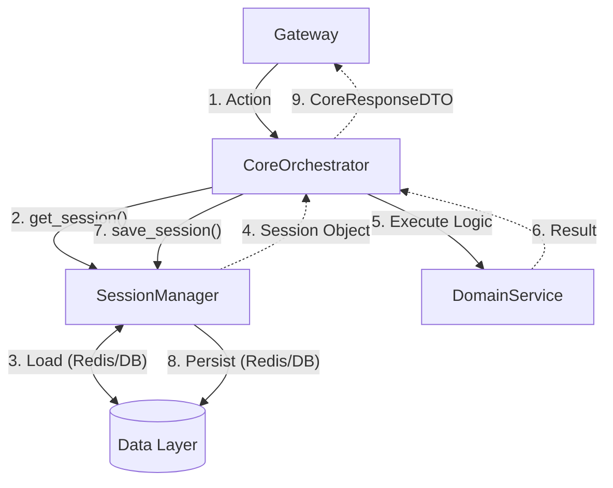
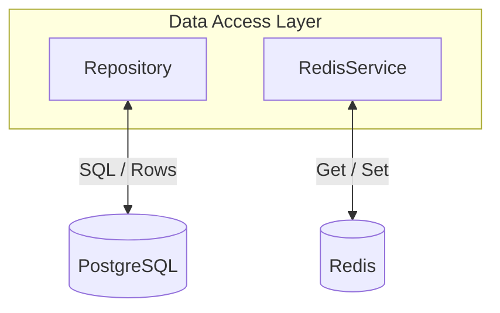

# Architecture Overview: Entity Map & Data Flow

Этот документ описывает структуру проекта и потоки данных.

---

## 1. General Architecture (Общая Схема)
Глобальные потоки данных между слоями.

---

## 2. Layer Details (Детализация Слоев)

### 2.1. Bot Application Layer (Presentation)
Слой представления.

### 2.2. Gateway Layer (Transport Bridge)
Слой транспорта.

#### Phase 1: Current Implementation (Monolith)
Клиент выступает абстрактной прослойкой.

#### Phase 2: Target Architecture (Microservices)
Сетевое взаимодействие через HTTP.

### 2.3. Game Core Layer (Business Logic)
Слой бизнес-логики.

#### A. Structure (Компоненты и Зависимости)
Кто кого содержит и использует.

#### B. Execution Flow (Поток выполнения)
Как обрабатывается один запрос.

### 2.4. Data Access Layer (Persistence)
Слой данных.

