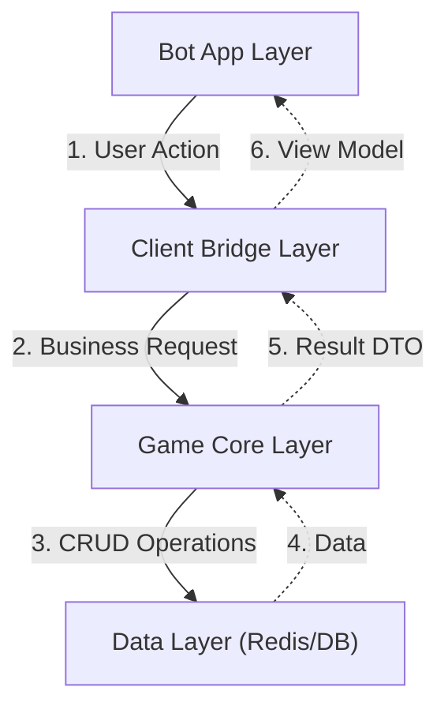
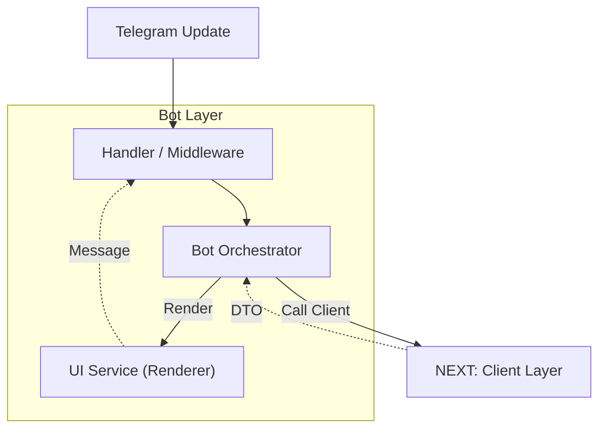
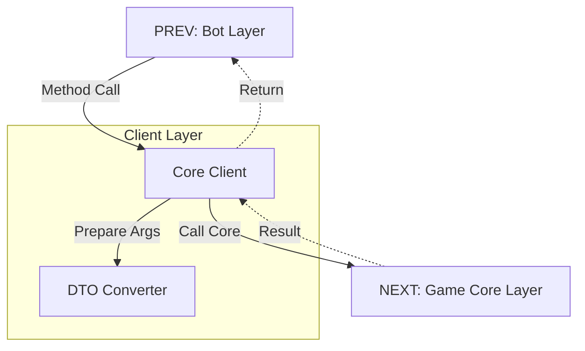
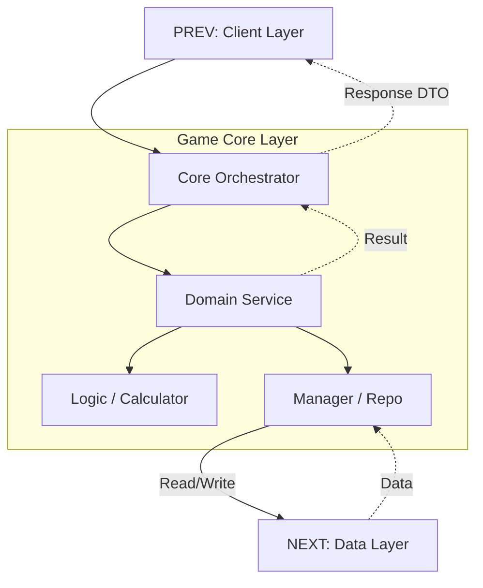
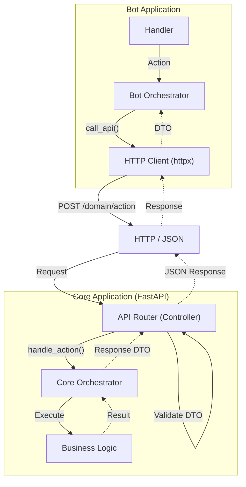

# Architecture Overview

## 1. The Big Picture (Global Flow)
Общая схема взаимодействия слоев. Каждый слой изолирован и общается только с соседями.

---

## 2. Layer Details (Current Monolith)

### 2.1. Bot Layer (Presentation)
Отвечает за Telegram API, FSM и отрисовку (View).

### 2.2. Client Layer (The Bridge)
Изолирует Бот от Ядра. Скрывает сложность DI и преобразует данные.

### 2.3. Game Core Layer (Business Logic)
Чистая бизнес-логика. Правила игры, расчеты, управление состоянием.

---

## 3. Target Architecture (HTTP API Microservices)
Целевая архитектура при разделении на микросервисы (Bot + Core API).

