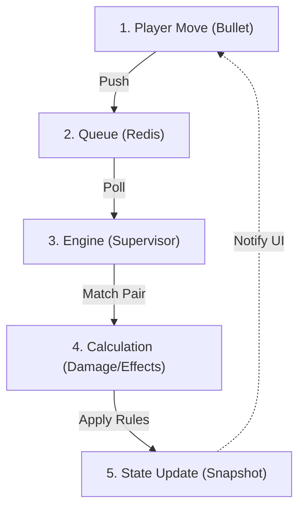
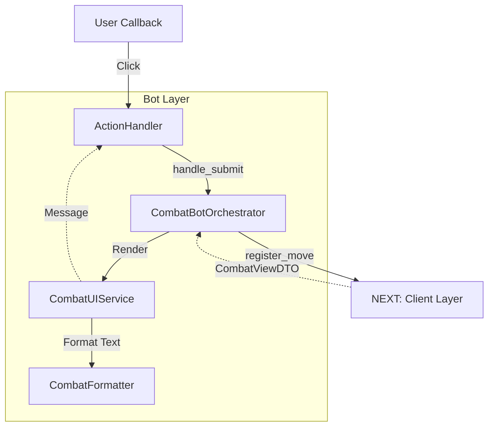
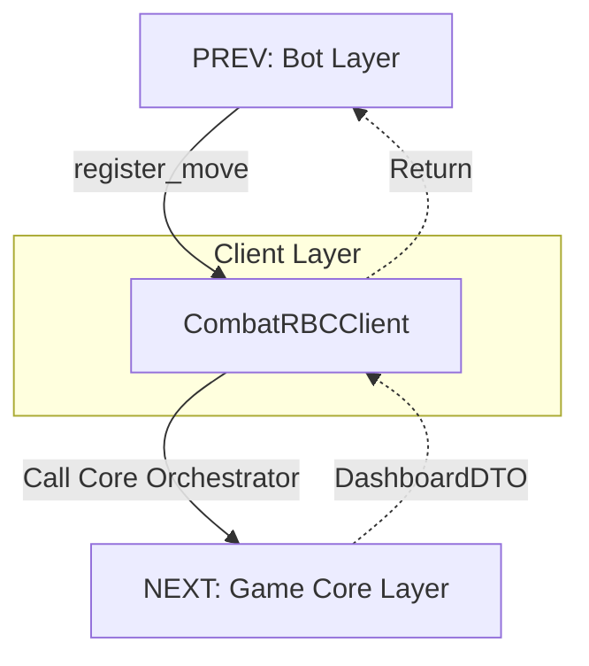
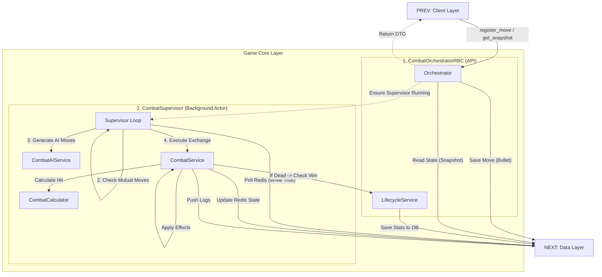
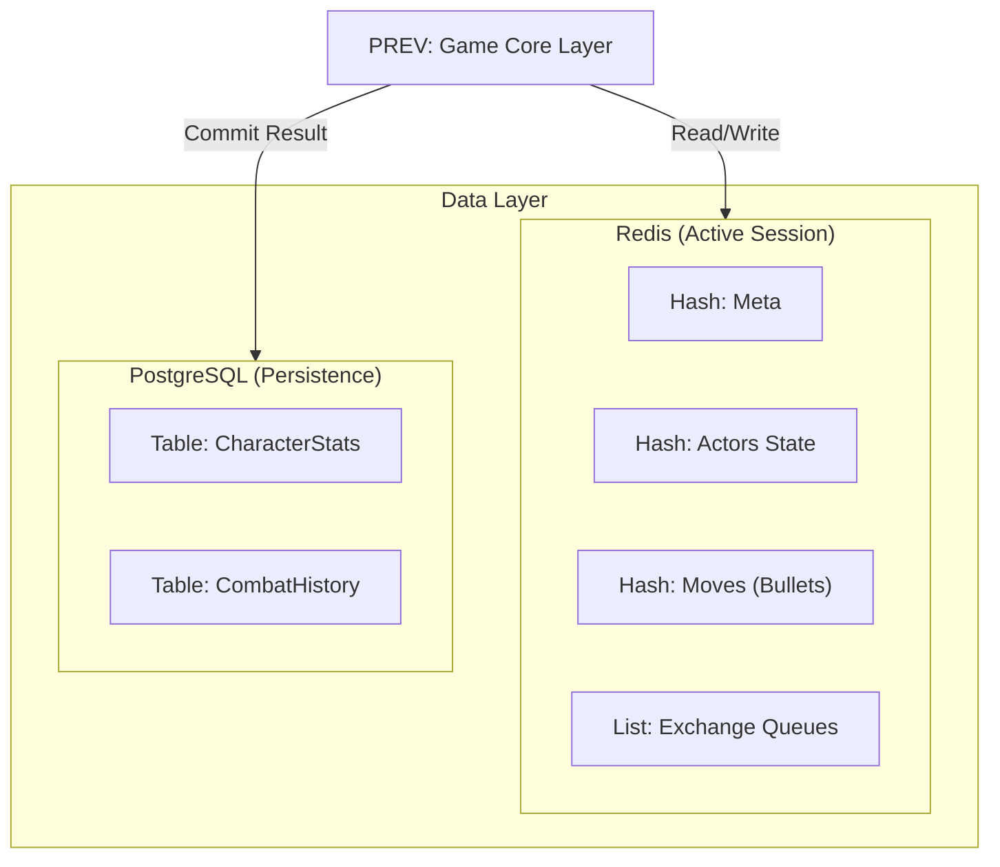
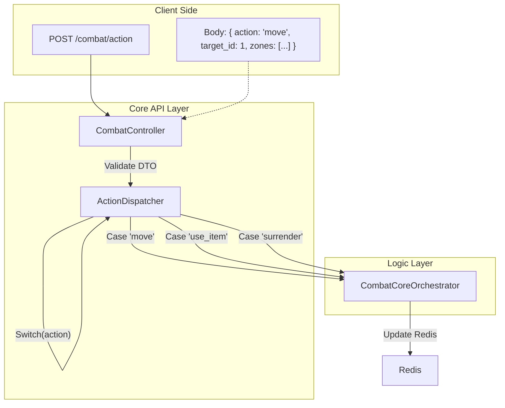

# Combat System Flow (RBC)

Эталонная реализация Session-Based архитектуры.

## 1. High-Level Process (RBC Loop)
Алгоритм боевого раунда: от заявки до результата.

---

## 2. Layer Details

### 2.1. Bot Layer (Presentation)
Отвечает за обработку кнопок и отрисовку экрана боя.

### 2.2. Client Layer (The Bridge)
Изолирует Бот от сложной логики RBC.

### 2.3. Game Core Layer (Business Logic)
Разделение на синхронный API (Оркестратор) и фоновый Актер (Супервизор).

### 2.4. Data Layer (Storage)
Redis хранит активную сессию (быстро). БД хранит результаты (надежно).

---

## 3. API Optimization Strategy
Единый роут для всех боевых действий.

