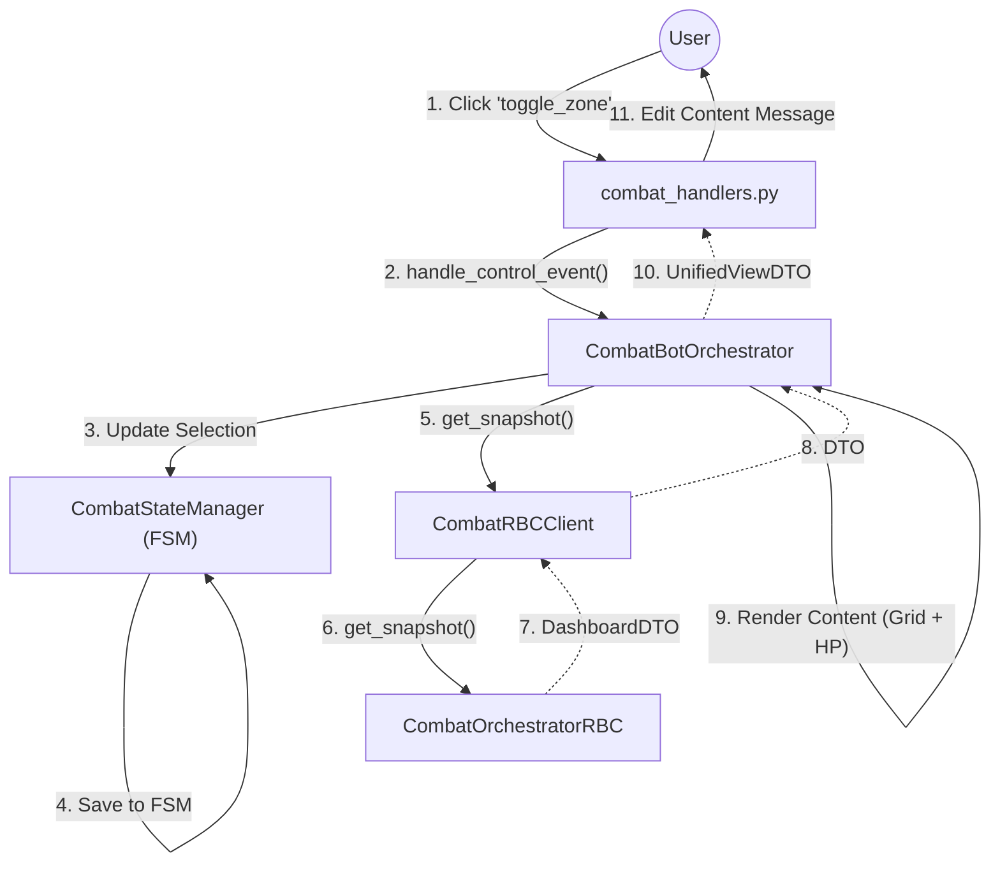
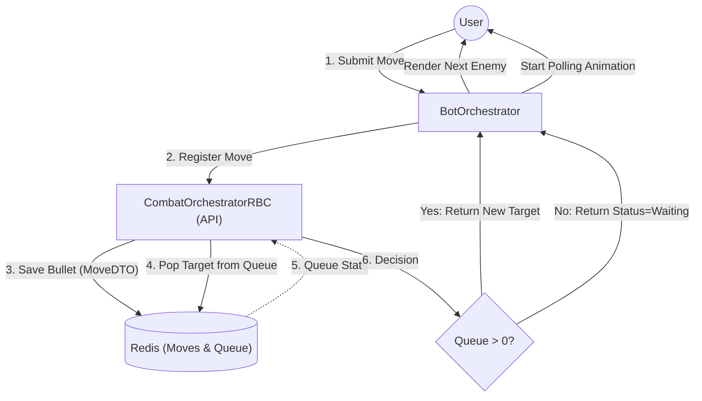
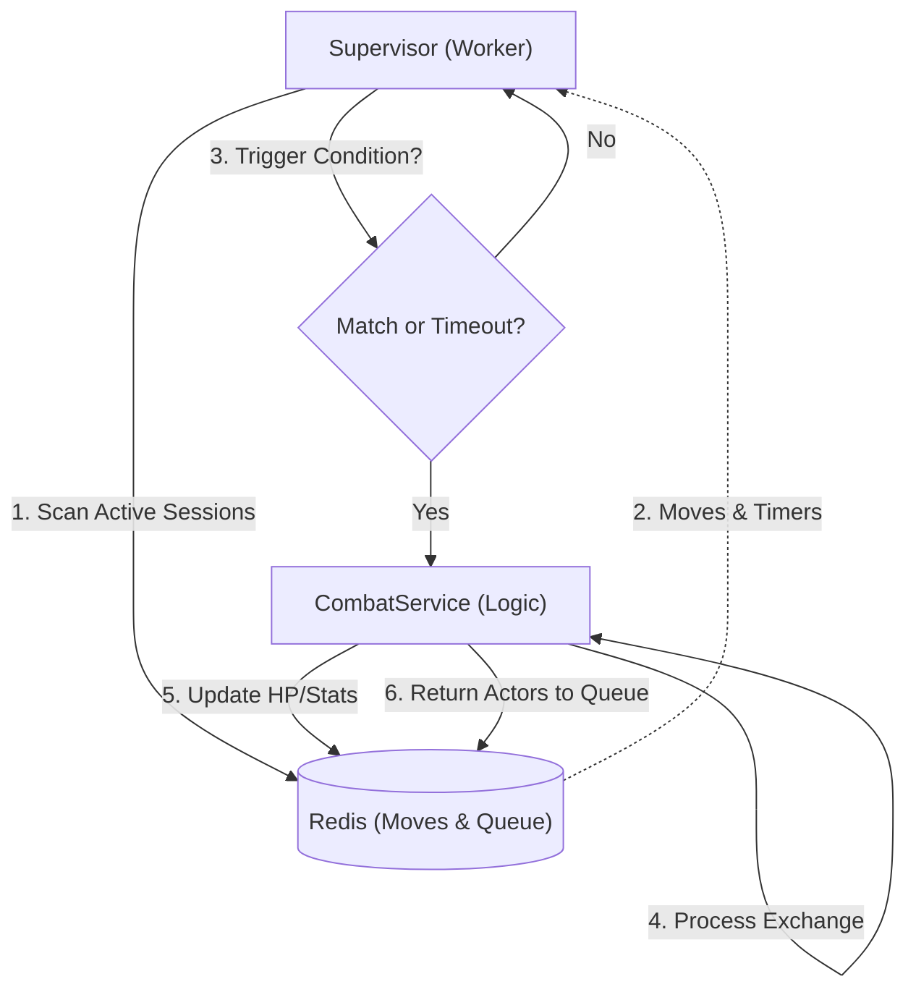

# Combat System Flow (RBC)

Этот документ описывает архитектуру модуля **Combat** (Боевая система).
Модуль реализует пошаговый бой (Round Based Combat) с механикой непрерывного обмена (Continuous Exchange) и асинхронной обработкой ходов.

---

## 1. Entity Map (Карта Сущностей)

### 1.1. Bot Application Layer
*   **Handlers**: `apps/bot/handlers/callback/game/combat/combat_handlers.py`
    *   `on_combat_control`: Управление боем (Зоны, Скиллы, Предметы). Обновляет Content (Нижнее сообщение).
    *   `on_combat_menu`: Управление меню (Лог, Настройки). Обновляет Menu (Верхнее сообщение).
    *   `on_combat_flow`: Жизненный цикл (Submit, Leave). Запускает анимацию ожидания (Polling).
*   **Orchestrator**: `CombatBotOrchestrator`.
    *   Управляет локальным стейтом (FSM) через `CombatStateManager`.
    *   Управляет анимацией ожидания (через `UIAnimationService`).
    *   Формирует `UnifiedViewDTO`.
*   **UI Services**:
    *   `CombatContentUI`: Рендерит Дашборд, Сетку, Меню скиллов/предметов.
    *   `CombatMenuUI`: Рендерит Лог боя.
    *   `CombatFlowUI`: Рендерит экраны ожидания и результатов.

### 1.2. Game Core Layer
*   **Orchestrator**: `CombatOrchestratorRBC`. Фасад (API).
    *   `register_move()`: Принимает ход и кладет в Redis.
    *   `get_dashboard_snapshot()`: Читает состояние из Redis.
*   **Session Manager**: `CombatManager`.
    *   Хранит маппинг `char_id -> session_id`.
    *   Загружает `CombatSessionContainerDTO` из Redis.
*   **Worker**: `CombatSupervisor`. Фоновый процесс.
    *   Сканирует активные сессии.
    *   Запускает расчет при совпадении условий (Match/Timeout).
*   **Engine**: `CombatService`. Чистая логика расчета урона.

---

## 2. Data Flow: Combat Controls (Управление Боем)

Игрок выбирает зоны атаки/защиты или использует предмет.

---

## 3. Continuous Exchange Pipeline (Asynchronous)

Система разделена на два независимых процесса, связанных через Redis.

### A. Input Flow (Client Side)
Игрок делает ход. Задача системы — принять заявку и вернуть управление (или статус ожидания).

### B. Processing Flow (Server Side)
Фоновый процесс обрабатывает заявки. Бот здесь не участвует.

### Детализация этапов:

1.  **Player Phase (UI)**:
    *   Игрок видит цель (первую из очереди).
    *   Делает ход (`Submit`).
    *   Пуля улетает в Redis, цель удаляется из начала очереди.
    *   Если в очереди есть **еще** враги — игрок сразу получает следующего.
    *   Если очередь пуста — игрок переходит в режим ожидания (`Waiting`).

2.  **Engine Phase (Supervisor)**:
    *   Воркер сканирует пули.
    *   **Trigger**: Запускает расчет, если:
        *   Есть встречная пуля (Враг тоже ударил).
        *   ИЛИ вышел таймер (Враг AFK).

3.  **Calculation Phase**:
    *   `CombatService` считает урон.
    *   **Rotation**: Возвращает живых бойцов в конец очередей друг друга.

4.  **Return Phase**:
    *   Очередь игрока пополняется (враг вернулся).
    *   Бот видит это через поллинг и разблокирует UI.

---

## 4. Key Decisions (Ключевые решения)

1.  **Asynchronous Processing**: Ввод хода и его расчет развязаны. Бот не ждет расчета, он ждет изменения состояния в Redis (через поллинг).
2.  **Continuous Flow**: Игрок может сделать несколько ходов подряд (по разным целям), если они есть в очереди. Блокировка UI (`Waiting`) наступает только когда очередь пуста.
3.  **Snapshot-Based UI**: При любом действии мы запрашиваем свежий снапшот. Это гарантирует, что игрок видит актуальное HP, даже если расчет произошел в фоне.
4.  **UI Layout**: Разделение на Menu (Лог) и Content (Дашборд) позволяет обновлять их независимо.
