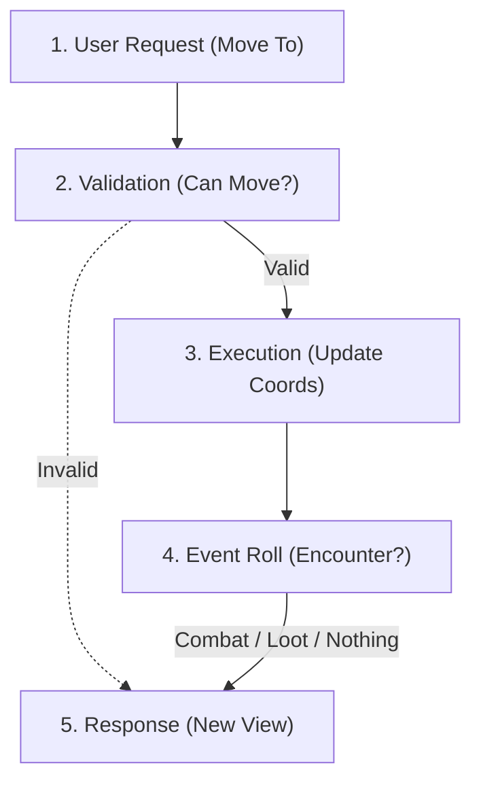
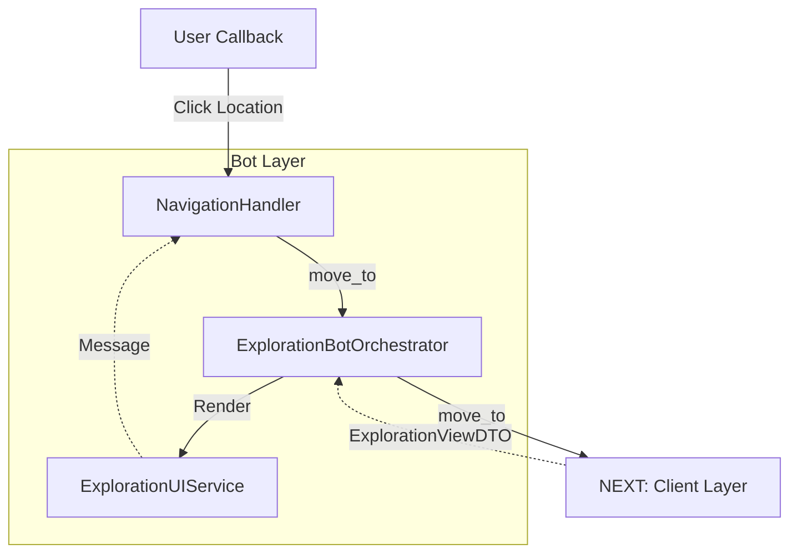
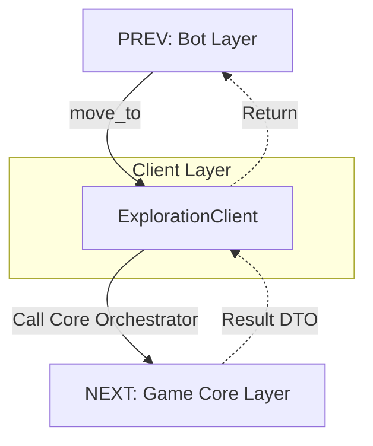
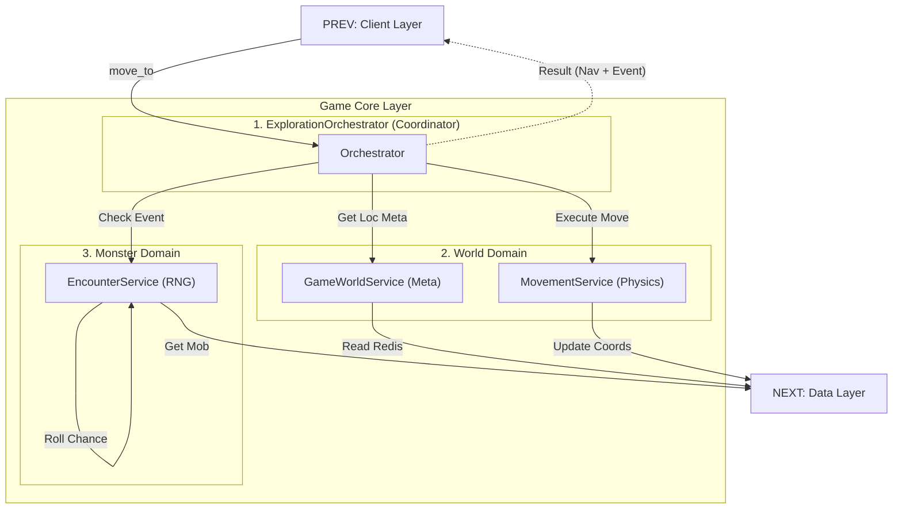
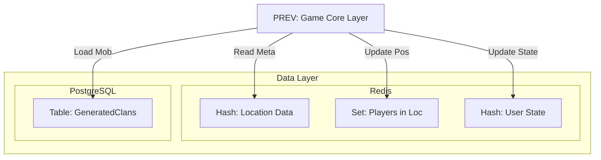
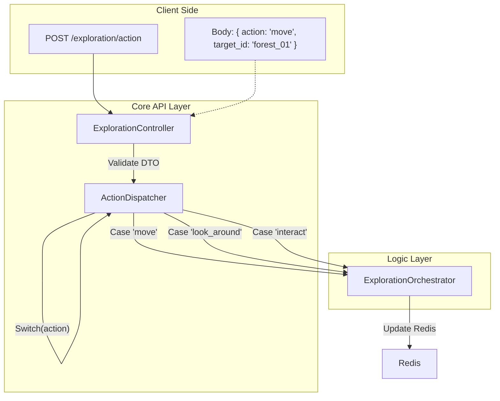

# Exploration & Navigation Flow

Архитектура исследования мира. Координация перемещения и случайных событий.

## 1. High-Level Process (Algorithm)
Алгоритм обработки перемещения: от запроса до результата.

---

## 2. Layer Details

### 2.1. Bot Layer (Presentation)
Отвечает за отрисовку кнопок навигации и сообщений о событиях.

### 2.2. Client Layer (The Bridge)
Изолирует Бот от логики мира.

### 2.3. Game Core Layer (Business Logic)
Оркестратор координирует сервисы из разных доменов.

### 2.4. Data Layer (Storage)
Redis хранит мир и игроков. БД хранит монстров.

---

## 3. API Optimization Strategy
Единый роут для действий в мире.

