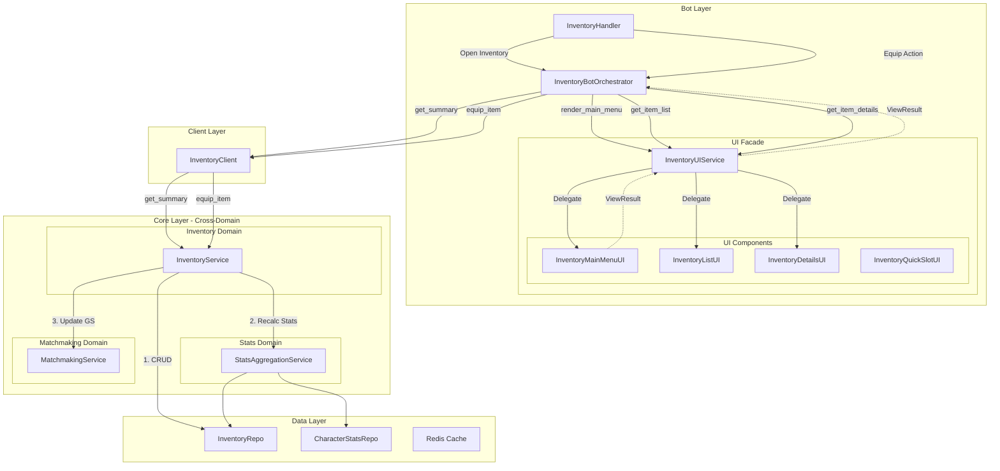
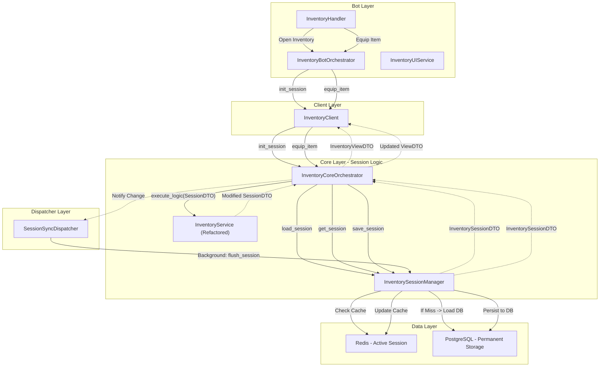
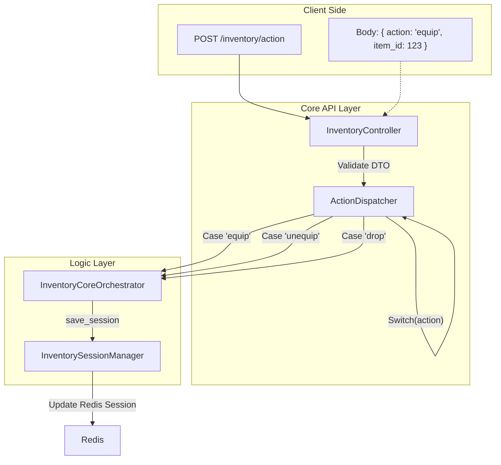

# Inventory System Flow

## 1. Current Architecture (AS IS)
Текущая реализация: UI-слой использует паттерн Facade, но Core-слой имеет сложные кросс-доменные зависимости и прямые запросы в БД.

## 2. Ideal Architecture (TO BE)
Целевая архитектура: "Session-Based Inventory". `InventoryCoreOrchestrator` управляет сессией через `InventorySessionManager` и делегирует бизнес-логику в `InventoryService`.

## 3. API Optimization Strategy (Single Endpoint)
Вместо десятка роутов (equip, unequip, move, drop) используем один `POST /inventory/action`.

