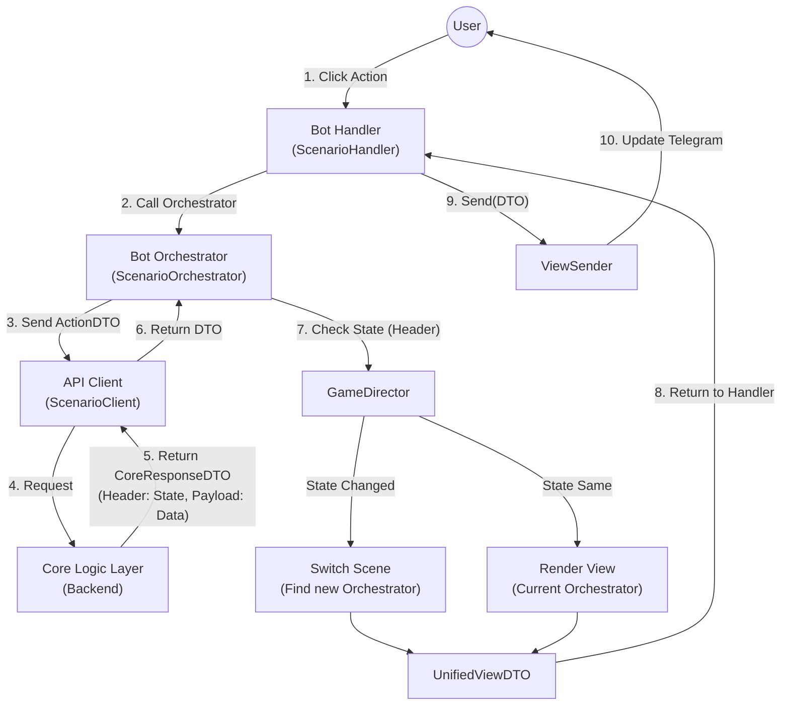

# Scenario & Quest Flow (Thin Client Architecture)

Реализация архитектуры "Тонкий Клиент", где Бот отвечает только за отображение (View) и пересылку действий, а Бэкенд (Core) управляет логикой и навигацией.

## 1. High-Level Process
Цикл обработки действий пользователя.



---

## 2. Key Components

### 2.1. CoreResponseDTO
Универсальный конверт ответа от бэкенда.
```python
class CoreResponseDTO(Generic[T]):
    header: GameStateHeader  # Навигация (current_state, screen_type)
    payload: T | None        # Данные для отображения
```

### 2.2. GameDirector
Центральный узел управления состоянием.
- **set_scene(state, payload)**: Меняет FSM состояние, находит нужный оркестратор и вызывает у него `render`.
- **handle_response(response)**: Умный метод, который сам решает: переключить сцену или отрендерить текущую.

### 2.3. ViewSender
Отвечает за физическое обновление сообщений.
- **Menu**: Верхнее сообщение (статус, навигация).
- **Content**: Основное сообщение (сценарий, бой, инвентарь).
- **Clean History**: Умеет удалять старые сообщения при смене контекста.

---

## 3. Data Flow Example (Scenario -> Combat)

1.  **User** нажимает "Атаковать".
2.  **Core** обрабатывает логику, понимает, что начался бой.
3.  **Core** возвращает:
    ```json
    {
      "header": { "current_state": "COMBAT", "screen_type": "START" },
      "payload": { "enemy": "Orc", "hp": 50 }
    }
    ```
4.  **ScenarioOrchestrator** видит `COMBAT` != `SCENARIO`.
5.  Вызывает `director.set_scene(COMBAT, payload)`.
6.  **Director** находит `CombatOrchestrator`.
7.  `CombatOrchestrator.render(payload)` создает экран боя.
8.  **ViewSender** заменяет текст сценария на экран боя.
