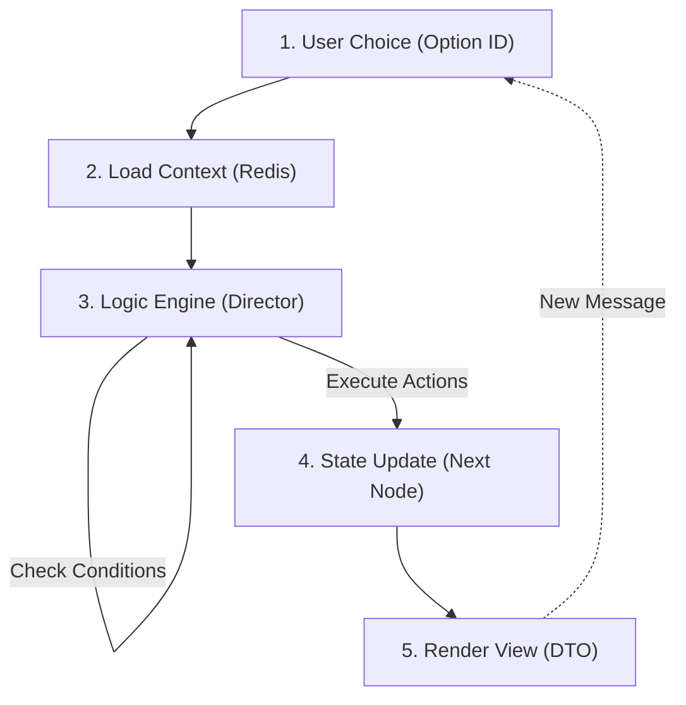
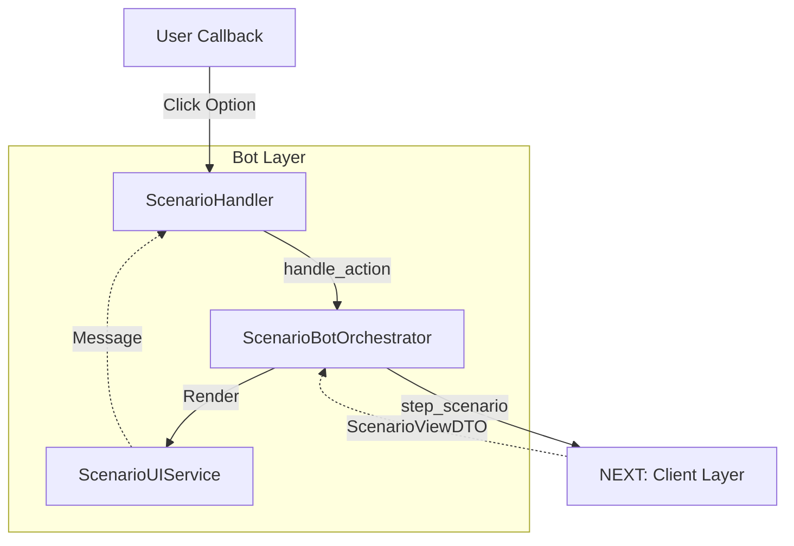
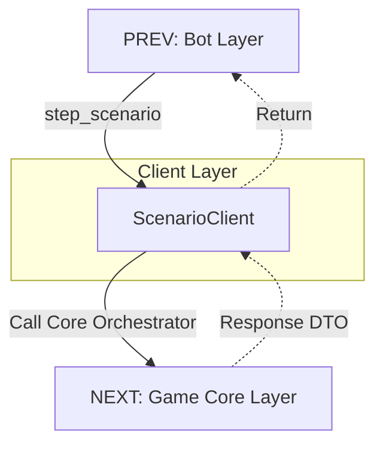
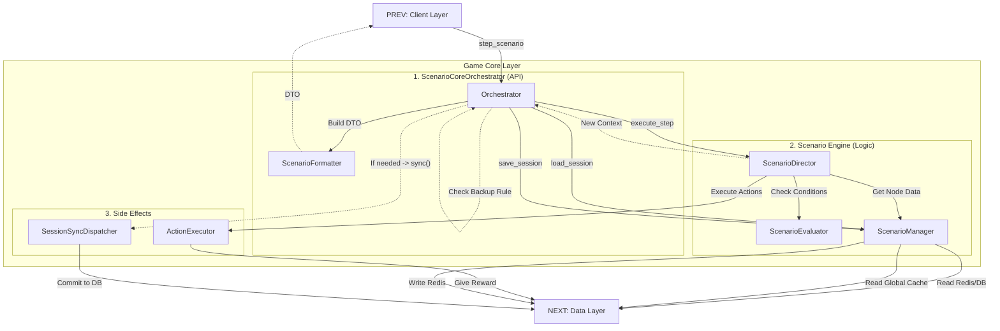
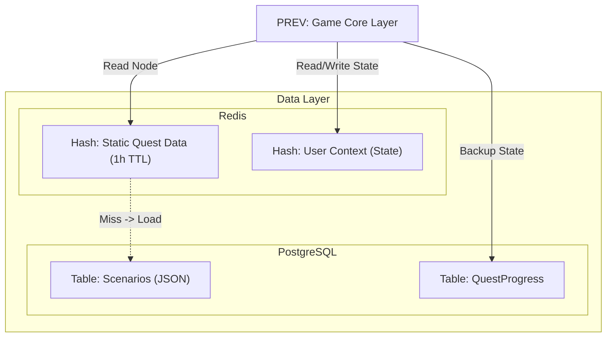
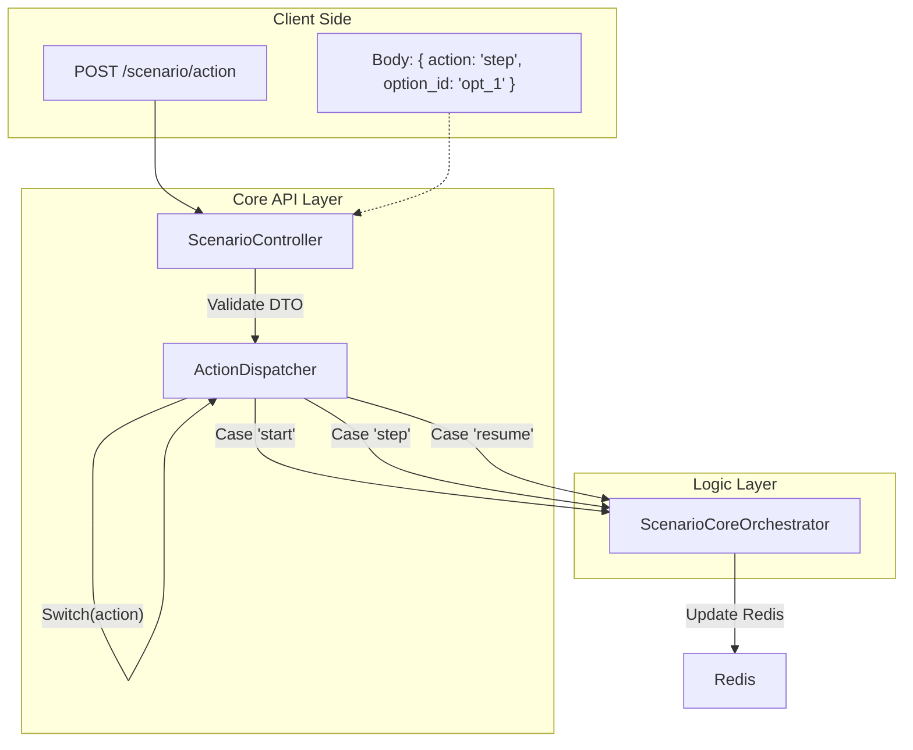

# Scenario & Quest Flow

Реализация Session-Based архитектуры для диалоговой системы.

## 1. High-Level Process (Dialogue Step)
Алгоритм обработки шага сценария.

---

## 2. Layer Details

### 2.1. Bot Layer (Presentation)
Отвечает за отрисовку диалогов и кнопок.

### 2.2. Client Layer (The Bridge)
Изолирует Бот от логики сценариев.

### 2.3. Game Core Layer (Business Logic)
Разделение на API (Оркестратор) и Движок (Director/Manager).

### 2.4. Data Layer (Storage)
Глобальный кэш для статики и сессии для пользователей.

---

## 3. API Optimization Strategy
Единый роут для управления сценарием.

