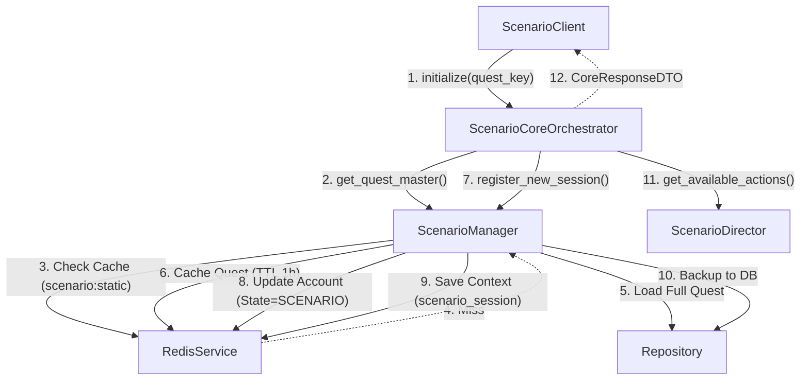
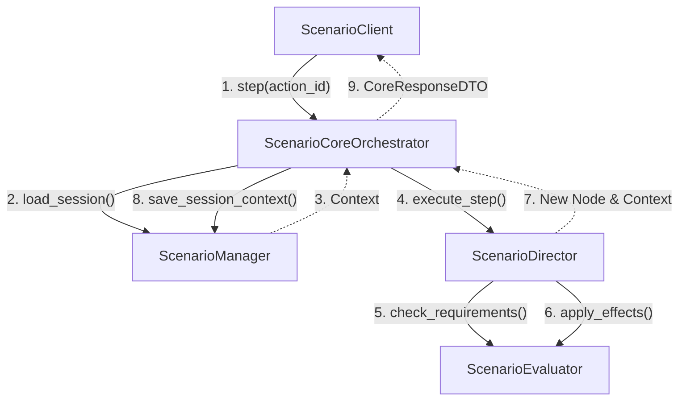
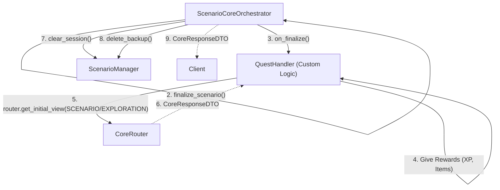

# Scenario & Quest Flow

Этот документ описывает архитектуру модуля **Scenario** (Квесты, Диалоги, Данжи).
Модуль реализует сложную логику управления состоянием и кэширования статических данных.

---

## 1. Entity Map (Карта Сущностей)

### 1.1. Bot Application Layer
*   **Orchestrator**: `ScenarioBotOrchestrator`. Презентер. Получает `ScenarioPayloadDTO` и отдает его в UI.
*   **UI Service**: `ScenarioUIService`. Строит экраны диалогов (текст, картинка, кнопки действий).
*   **Client**: `ScenarioClient`. Интерфейс API.

### 1.2. Game Core Layer
*   **Orchestrator**: `ScenarioCoreOrchestrator`. Фасад. Координирует работу компонентов.
*   **Data Manager**: `ScenarioManager`.
    *   **User Session**: Хранит прогресс игрока в Redis (`scenario_session:{char_id}`) с бэкапом в БД.
    *   **Static Cache**: Кэширует структуру квеста в Redis (`scenario:static:{quest_key}`).
*   **Logic Engine**:
    *   `ScenarioDirector`: Определяет доступные действия и следующую ноду.
    *   `ScenarioEvaluator`: Проверяет условия (Requirements) и выполняет эффекты (Rewards).
*   **Formatter**: `ScenarioFormatter`. Собирает `ScenarioPayloadDTO`.
*   **Quest Handlers**: Специализированные классы для кастомной логики квестов (награды, сложные переходы).

---

## 2. Data Flow: Initialization (Start Quest)

Запуск квеста. Система должна загрузить структуру квеста и создать сессию.

---

## 3. Data Flow: Step Execution (Player Choice)

Игрок выбирает вариант ответа.

---

## 4. Data Flow: Finalization (Quest Complete)

Квест завершен. Нужно выдать награду и вернуть игрока в мир.

---

## 5. Key Decisions (Ключевые решения)

1.  **Static Content Caching**: Структура квеста (тексты, связи) не меняется часто. Мы загружаем весь квест из БД один раз и храним в Redis (`scenario:static:{key}`) с TTL 1 час. Это снижает нагрузку на БД при каждом шаге.
2.  **Session Resilience**: Сессия игрока живет в Redis. Если Redis падает или очищается, `ScenarioManager` умеет восстанавливать сессию из БД (`get_active_state`), где хранится бэкап.
3.  **Handler Registry**: Логика конкретных квестов (особенно финальные награды) вынесена из ядра в отдельные классы-хендлеры. Это позволяет писать уникальные скрипты для каждого квеста, не загрязняя общий движок.
