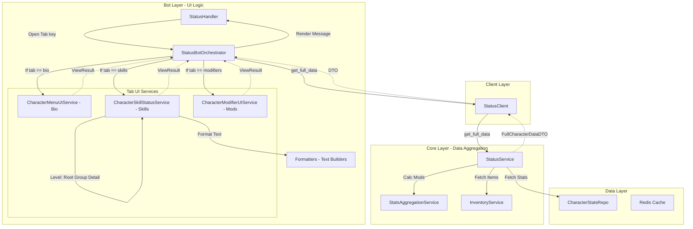
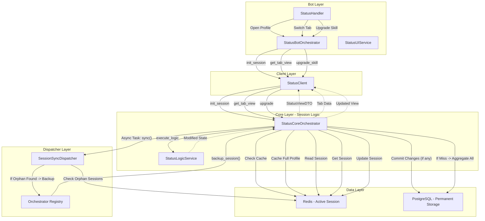
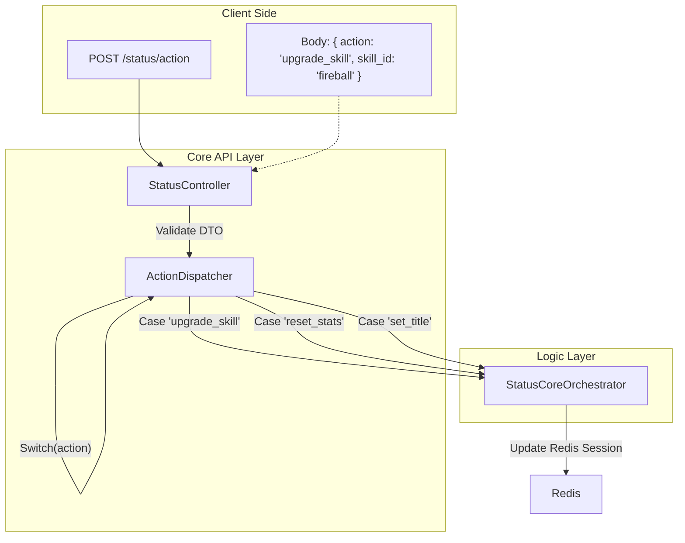

# Status & Character Menu Flow

## 1. Current Architecture (AS IS)
Текущая реализация: "Агрегатор в Боте". Оркестратор и Сервис знают слишком много о связях между доменами.

## 2. Ideal Architecture (TO BE)
Целевая архитектура: "Session-Based Status". CoreOrchestrator управляет сессией и делегирует логику сервису.

## 3. API Optimization Strategy (Action Dispatcher)
Объединяем все действия с персонажем (прокачка, сброс, смена титула) в один роут.

