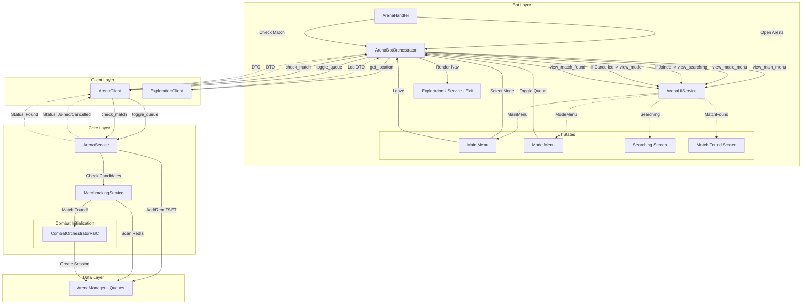

# Arena & Matchmaking Flow

Цепочка поиска противника и старта боя.
**Примечание:** Оркестратор управляет состояниями UI (Меню -> Поиск -> Матч).

```mermaid
graph TD
    %% --- СЛОИ ---
    subgraph Bot_Layer ["Bot Layer"]
        Handler["ArenaHandler"]
        Orch["ArenaBotOrchestrator"]
        UI["ArenaUIService"]
        
        subgraph UI_States ["UI States"]
            MainMenu["Main Menu"]
            ModeMenu["Mode Menu"]
            Searching["Searching Screen"]
            MatchFound["Match Found Screen"]
        end
        
        ExplUI["ExplorationUIService - Exit"]
    end

    subgraph Client_Layer ["Client Layer"]
        Client["ArenaClient"]
        ExplClient["ExplorationClient"]
    end

    subgraph Core_Layer ["Core Layer"]
        Service["ArenaService"]
        MM["MatchmakingService"]
        
        subgraph Combat_Init ["Combat Initialization"]
            CombatOrch["CombatOrchestratorRBC"]
        end
    end

    subgraph Data_Layer ["Data Layer"]
        Redis["ArenaManager - Queues"]
    end

    %% --- FLOW ---
    
    %% 1. Navigation
    Handler -->|"Open Arena"| Orch
    Orch -->|"view_main_menu"| UI
    UI -.->|"MainMenu"| MainMenu
    
    MainMenu -->|"Select Mode"| Orch
    Orch -->|"view_mode_menu"| UI
    UI -.->|"ModeMenu"| ModeMenu

    %% 2. Queue Logic
    ModeMenu -->|"Toggle Queue"| Orch
    Orch -->|"toggle_queue"| Client
    Client -->|"toggle_queue"| Service
    Service -->|"Add/Rem ZSET"| Redis
    
    Service -.->|"Status: Joined/Cancelled"| Client
    Client -.->|"DTO"| Orch
    
    Orch -->|"If Joined -> view_searching"| UI
    UI -.->|"Searching"| Searching
    
    Orch -->|"If Cancelled -> view_mode"| UI

    %% 3. Matchmaking Check (Polling)
    Handler -->|"Check Match"| Orch
    Orch -->|"check_match"| Client
    Client -->|"check_match"| Service
    Service -->|"Check Candidates"| MM
    MM -->|"Scan Redis"| Redis
    
    MM -->|"Match Found!"| CombatOrch
    CombatOrch -->|"Create Session"| Redis
    
    Service -.->|"Status: Found"| Client
    Client -.->|"DTO"| Orch
    Orch -->|"view_match_found"| UI
    UI -.->|"MatchFound"| MatchFound

    %% 4. Exit
    MainMenu -->|"Leave"| Orch
    Orch -->|"get_location"| ExplClient
    ExplClient -.->|"Loc DTO"| Orch
    Orch -->|"Render Nav"| ExplUI

    %% --- Вертикальное выравнивание ---
    Orch ~~~ Client ~~~ Service ~~~ Redis
```