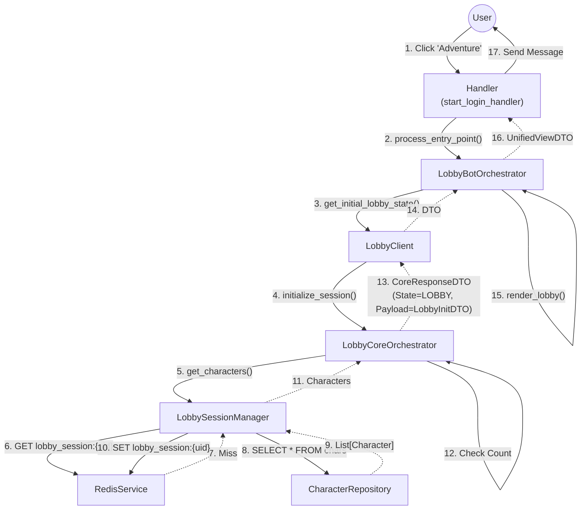
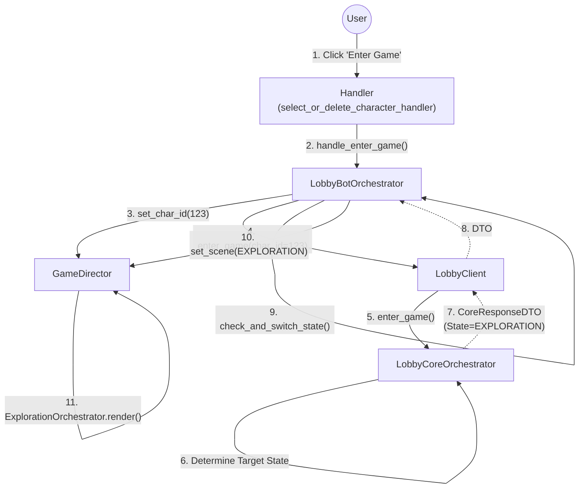

# Lobby & Entry Flow

Этот документ описывает архитектуру модуля **Lobby** (Вход в игру и выбор персонажа).
Модуль следует стандарту "Тонкий Клиент" (см. `01_Architecture_Overview.md`).

---

## 1. Entity Map (Карта Сущностей)

### 1.1. Bot Application Layer
*   **Handlers**:
    *   `start_login_handler` (в `lobby.py`): Вход в лобби (кнопка "Adventure").
    *   `select_or_delete_character_handler` (в `lobby_character_selection.py`): Действия внутри (выбор, удаление, логин).
*   **Orchestrator**: `LobbyBotOrchestrator`. Управляет логикой отображения лобби.
*   **UI Service**: `LobbyService`. Строит меню выбора персонажей и статус.
*   **Client**: `LobbyClient`. Интерфейс для общения с Core.

### 1.2. Game Core Layer
*   **Orchestrator**: `LobbyCoreOrchestrator`. Фасад модуля. Управляет списком персонажей.
*   **Session Manager**: `LobbySessionManager`. Реализует паттерн Cache-Aside для списка персонажей.
*   **Data Access**:
    *   `CharacterRepository` (PostgreSQL).
    *   `RedisService` + `RedisKeys` (Redis Cache).

---

## 2. Data Flow: Initialization (Вход в Лобби)

Пользователь нажимает "Adventure". Система проверяет наличие персонажей.

---

## 3. Data Flow: Enter Game (Вход в мир)

Пользователь выбирает персонажа и нажимает "Войти".

---

## 4. Key Decisions (Ключевые решения)

1.  **Cache-Aside**: Список персонажей кэшируется в Redis (`lobby_session:{user_id}`) на 1 час. При создании/удалении персонажа кэш инвалидируется.
2.  **State Switching**: `LobbyCoreOrchestrator` сам решает, куда отправить пользователя. Если персонажей нет — он возвращает `header.current_state = ONBOARDING`. Бот просто подчиняется.
3.  **Session Context**: ID выбранного персонажа сохраняется в FSM (`GameDirector.set_char_id`) только на момент входа в игру. В самом лобби `char_id` передается в аргументах колбэка.
