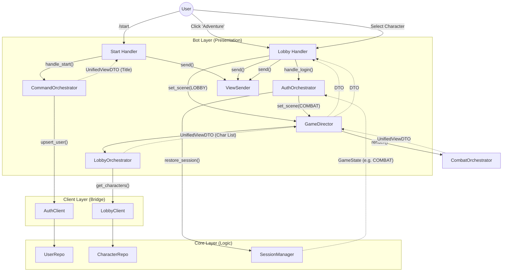
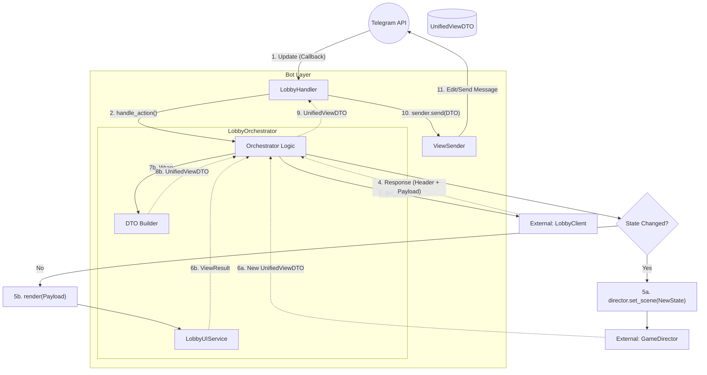
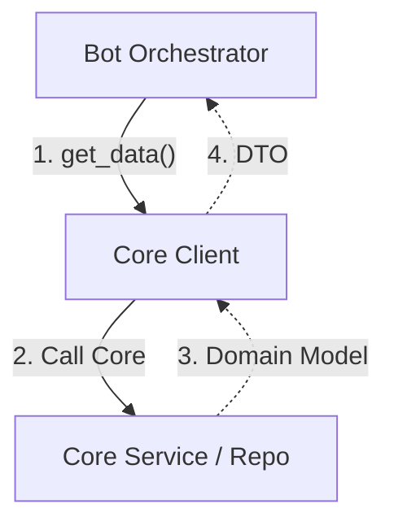
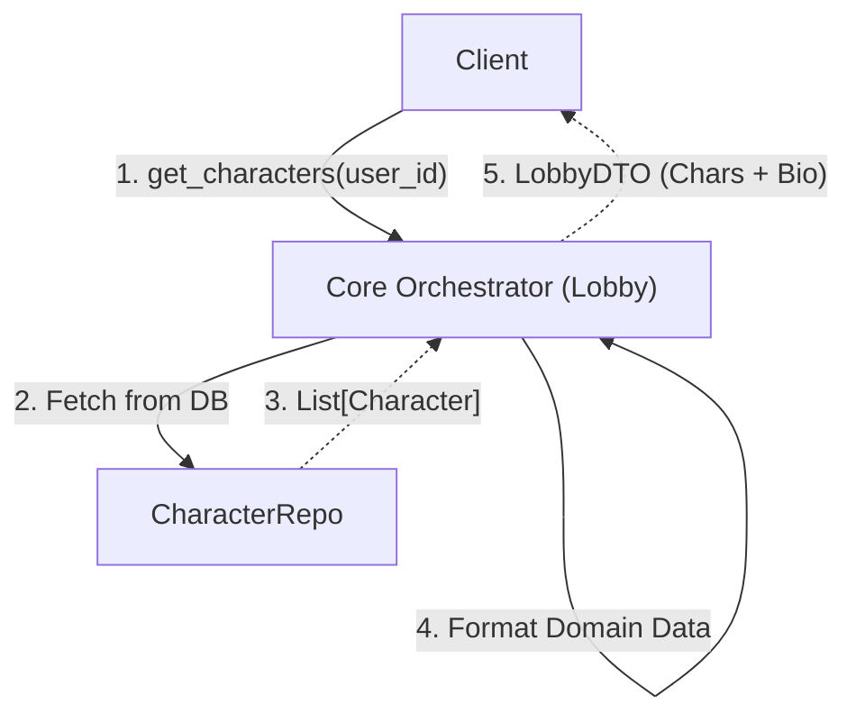

# Lobby & Entry Flow (V2 Architecture)

## 1. The Big Picture (Ideal Flow)
Общая схема входа в игру: от команды `/start` до появления в игровом мире.

---

## 2. Layer Details

### 2.1. Bot Layer (Presentation)
Отвечает за обработку команд, управление сценами (Director) и отправку сообщений (Sender).

### 2.2. Client Layer (Bridge)
Связующее звено. Преобразует вызовы оркестратора в запросы к ядру (или БД для простых операций).

### 2.3. Game Core Layer (Logic)
Бизнес-логика. Для процесса входа (Login) это управление сессией и восстановление состояния.

