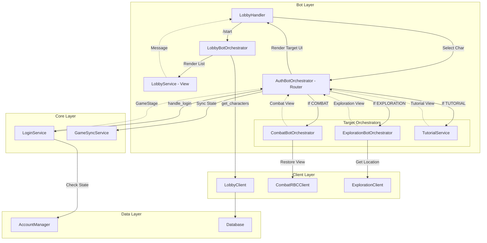
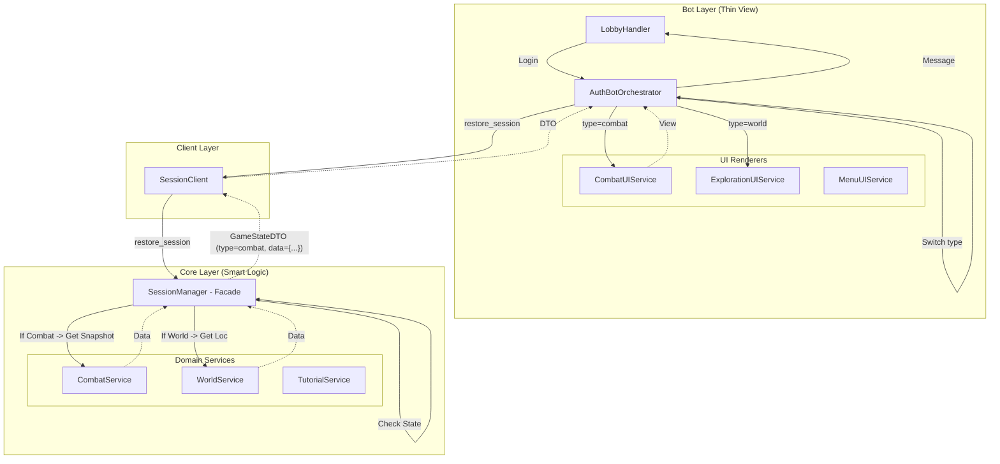

# Lobby & Entry Flow

## 1. Current Architecture (AS IS)
Текущая реализация: "Толстый Бот". Оркестратор сам управляет зависимостями и восстанавливает состояние, обращаясь к разным клиентам.

## 2. Ideal Architecture (TO BE)
Целевая архитектура: "Тонкий Бот". Вся логика восстановления состояния инкапсулирована в Core. Бот получает полиморфный DTO и просто выбирает рендерер.

