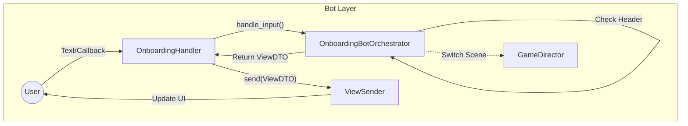
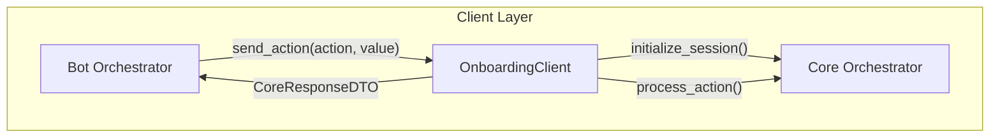
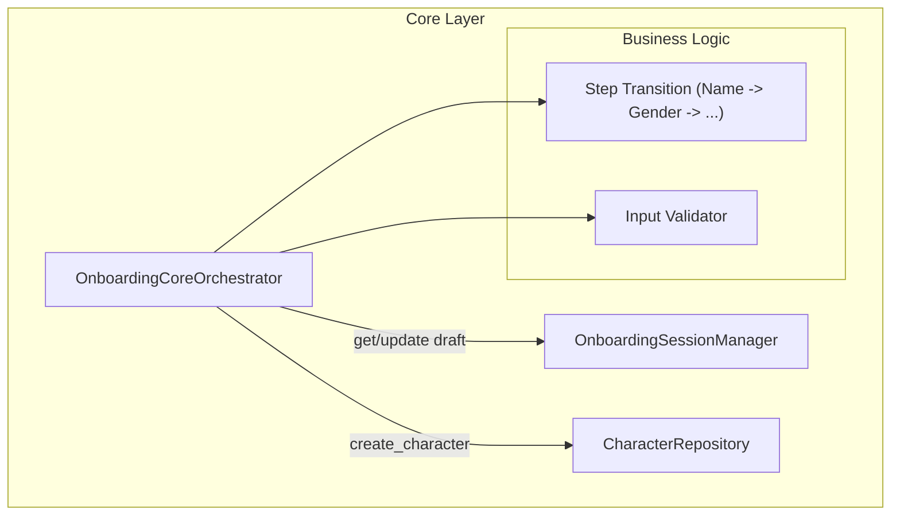
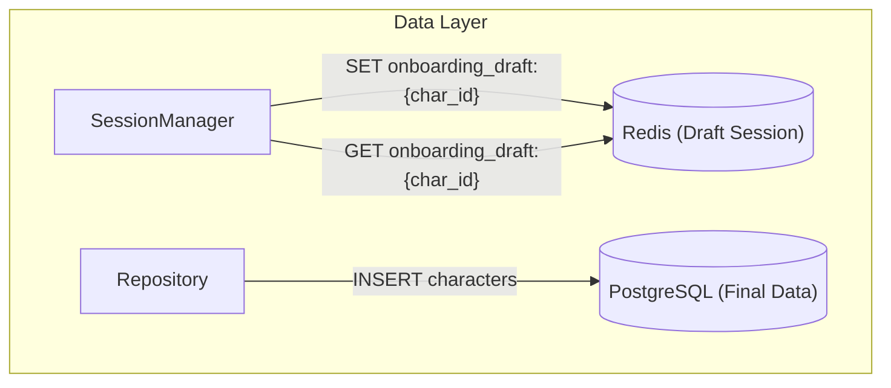

# Onboarding & Character Creation Flow

## Architecture Overview

Мы используем вертикальную архитектуру с разделением на слои.
Данные черновика (Draft) хранятся в Redis (Core Layer) и не гоняются туда-сюда целиком, только необходимые DTO для отображения.

---

## 1. Bot Layer (UI & Management)
**Responsibility:** Обработка ввода, управление UI, делегирование логики.

---

## 2. Client Layer (Transport)
**Responsibility:** Транспорт данных между Bot и Core. Превращает вызовы методов в запросы (DTO).

---

## 3. Core Layer (Business Logic & State)
**Responsibility:** Валидация, управление шагами, хранение черновика, финализация.

---

## 4. Data Layer (Storage)
**Responsibility:** Хранение данных.

---

## Data Flow Example: "Set Name"

1.  **Bot:** Юзер пишет "Hero". Хендлер передает это в Оркестратор.
2.  **Client:** Оркестратор вызывает `client.send_action(char_id, "set_name", "Hero")`.
3.  **Core:**
    *   `CoreOrchestrator` получает запрос.
    *   Валидирует ("Hero" - ок).
    *   `SessionManager` обновляет Redis: `name="Hero"`.
    *   `CoreOrchestrator` переключает шаг на `GENDER`.
    *   Возвращает `CoreResponseDTO` (Header=ONBOARDING, Payload=ViewDTO(step=GENDER)).
4.  **Bot:** Оркестратор получает ответ, формирует UI выбора пола и отправляет через `ViewSender`.
