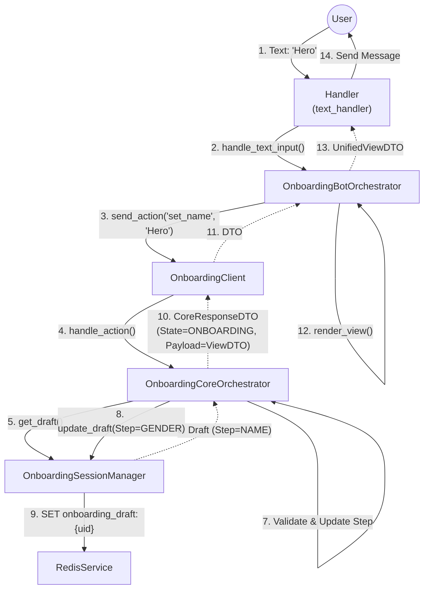
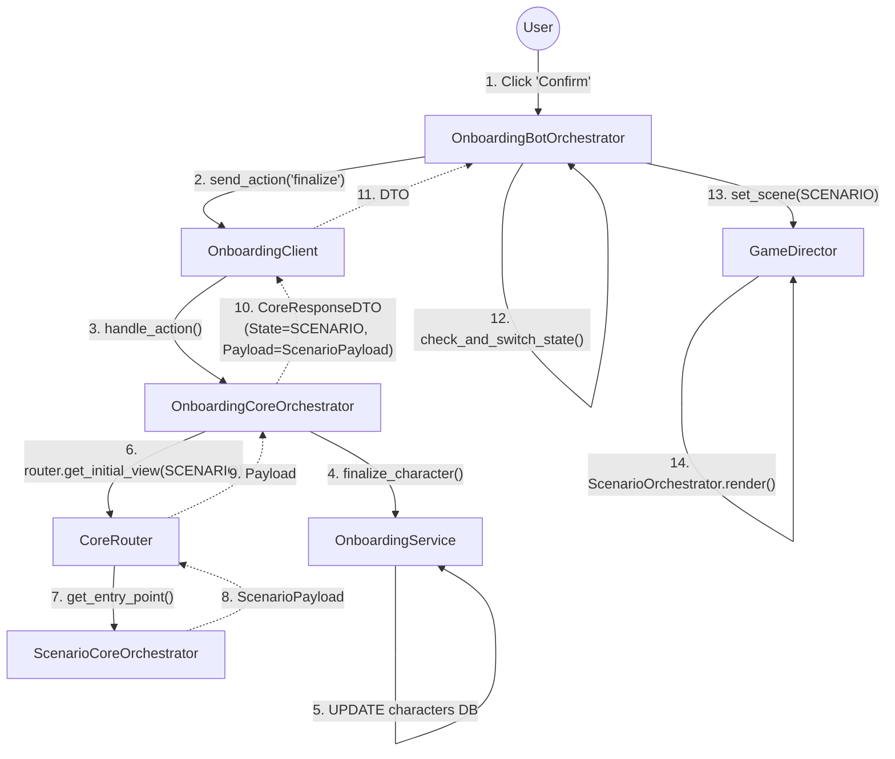

# Onboarding & Character Creation Flow

Этот документ описывает архитектуру модуля **Onboarding** (Создание персонажа).
Модуль следует стандарту "Тонкий Клиент" (см. `01_Architecture_Overview.md`).

---

## 1. Entity Map (Карта Сущностей)

### 1.1. Bot Application Layer
*   **Handler**: `onboarding_handler.py`. Обрабатывает колбэки и текстовый ввод (имя).
*   **Orchestrator**: `OnboardingBotOrchestrator`. Управляет флагами рендеринга (нужно ли обновлять меню).
*   **UI Service**: `OnboardingUIService`. Строит экраны (Приветствие, Ввод имени, Выбор пола).
*   **Client**: `OnboardingClient`. Интерфейс для общения с Core.

### 1.2. Game Core Layer
*   **Orchestrator**: `OnboardingCoreOrchestrator`. Фасад модуля. Управляет шагами (Step Machine).
*   **Session Manager**: `OnboardingSessionManager`. Хранит временный черновик (`OnboardingDraftDTO`) в Redis.
*   **Domain Service**: `OnboardingService`. Отвечает за создание записи в БД (`create_shell`, `finalize`).
*   **Router**: `CoreRouter`. Используется для перехода в Сценарий после завершения.

---

## 2. Data Flow: Step Transition (Смена шага)

Пример: Пользователь вводит имя "Hero".

---

## 3. Data Flow: Finalization (Завершение)

Пользователь подтверждает создание. Происходит переход в игру.

---

## 4. Key Decisions (Ключевые решения)

1.  **Draft Storage**: Черновик хранится в Redis (`onboarding_draft:{user_id}`) и живет 24 часа. Это позволяет не мусорить в основной БД недосозданными персонажами.
2.  **Shell Creation**: При старте создается "болванка" персонажа в БД (`create_shell`), чтобы зарезервировать ID. Если пользователь бросит процесс, болванка останется (можно чистить кроном).
3.  **Core Router**: Онбординг не знает деталей Сценария. Он просто просит Роутер: "Дай мне начальный экран Сценария для этого персонажа".
