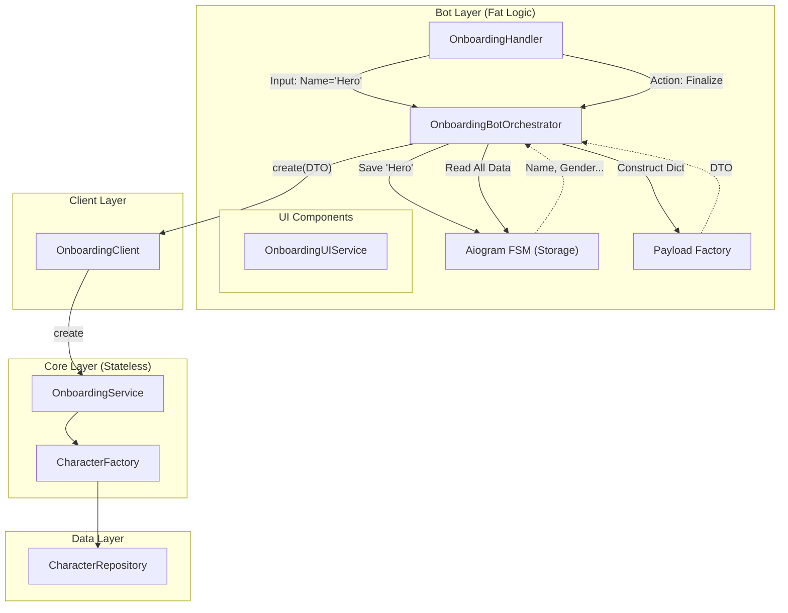
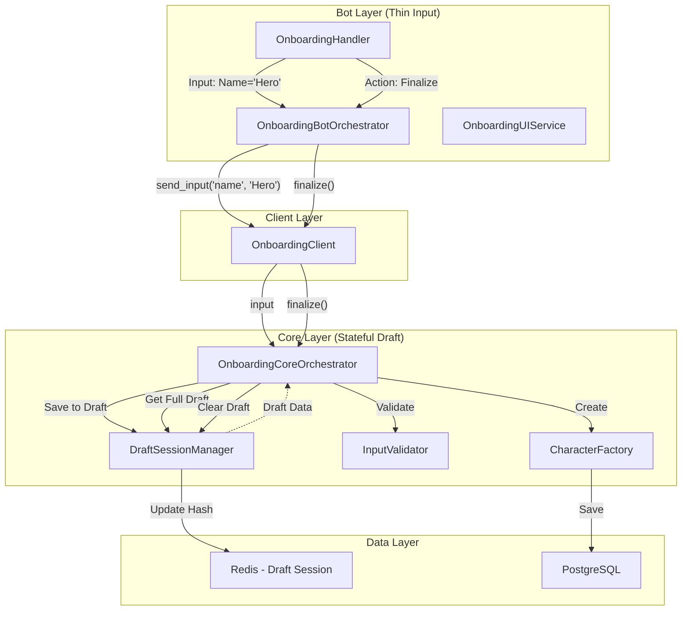
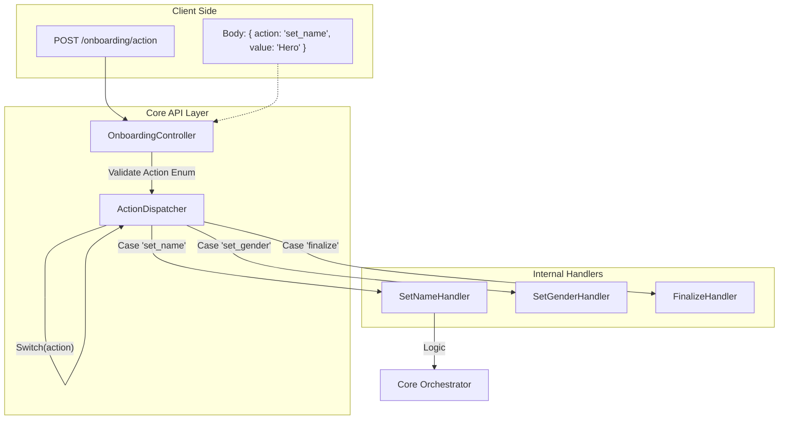

# Onboarding & Character Creation Flow

## 1. Current Architecture (AS IS)
Текущая реализация: "FSM as Database". Бот хранит черновик персонажа (имя, пол) в своем FSM и собирает итоговый объект через Payload Factory.
**Проблема:** При смене клиента (например, на Web) прогресс создания потеряется, так как он привязан к FSM бота.

## 2. Ideal Architecture (TO BE)
Целевая архитектура: "Core Draft Session". Черновик персонажа хранится в Core (Redis). Бот просто отправляет инпуты.
**Преимущество:** Мультиплатформенность. Можно начать создавать в Telegram, продолжить в Web.

## 3. API Optimization Strategy (Action Dispatcher)
Как избежать создания сотен роутов. Используем один универсальный эндпоинт с полиморфным DTO.

