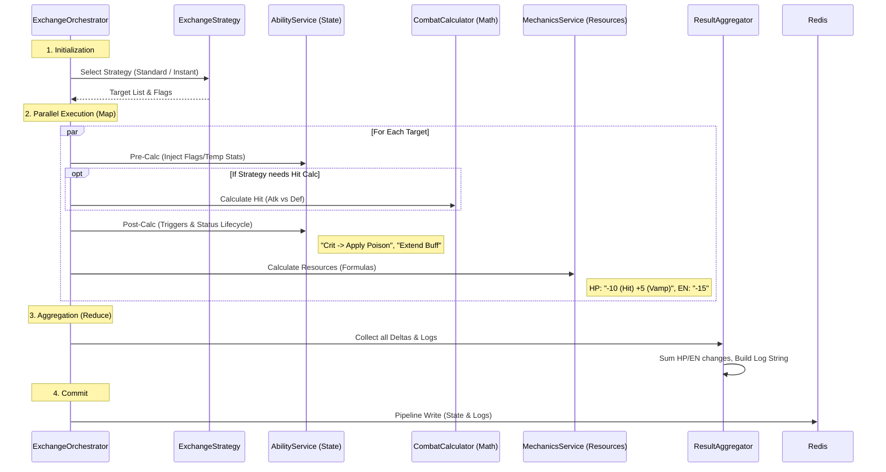

# Combat Exchange Architecture (RBC v2.0)

Этот документ описывает архитектуру `CombatExchangeOrchestrator` — центрального узла, управляющего любым взаимодействием в бою (Удар, Хил, Бафф, AoE).

## 1. Концепция: Map-Reduce Pipeline

Процесс обработки действия разбит на 4 стадии. Стадии 1-3 выполняются **параллельно** для каждой цели (Map). Стадия 4 собирает результаты и применяет их атомарно (Reduce/Commit).

### Ключевые принципы
1.  **Stateless Logic:** Сервисы внутри пайплайна (Ability, Calculator, Mechanics) не пишут в БД. Они возвращают "Дельты" (изменения).
2.  **Strategy Pattern:** Оркестратор выбирает стратегию в зависимости от типа действия (Standard, Instant, AoE).
3.  **Deferred Commit:** Все изменения применяются только в конце, что позволяет избежать гонок данных при массовых ударах.

---

## 2. Поток Данных (The Flow)

