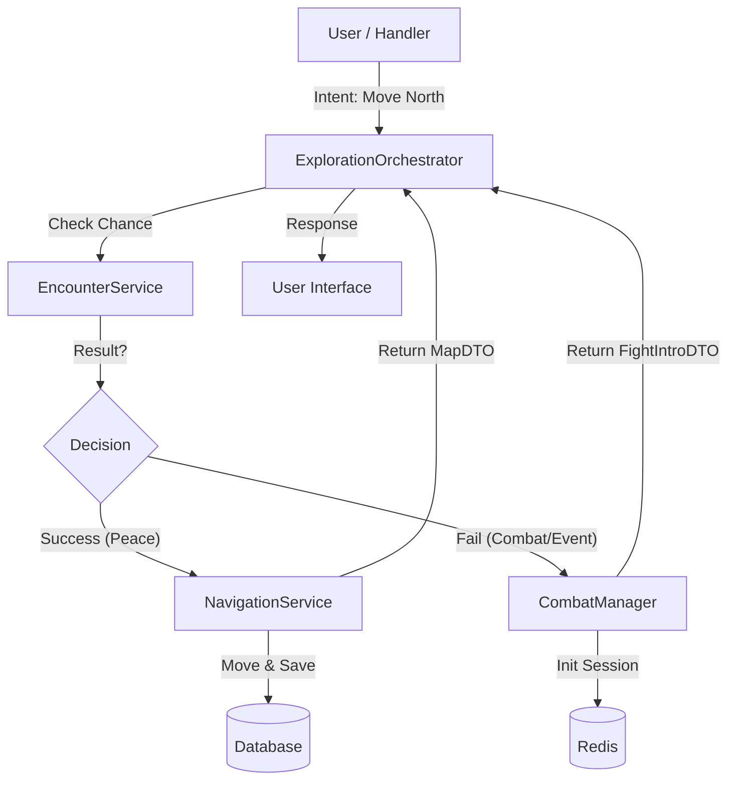

# 🧭 Exploration & Encounters System (Design Document)

> **Status:** Draft
> **Focus:** Архитектура перехода между исследованием мира и боевыми столкновениями.

## 1. Проблема и Решение

### Проблема
Текущая реализация перемещения имеет риск нарушения **Single Responsibility Principle**:
1.  Если оставить логику проверок в хэндлерах (`apps/bot/handlers/...`), код станет перегруженным условиями `if/else`.
2.  Если перенести логику шансов в `NavigationService`, он перестанет быть просто "двигателем координат" и начнет отвечать за игровую механику (броски кубиков), что неверно.

### Решение: ExplorationOrchestrator
Вводится новый слой — **ExplorationOrchestrator** (или Facade). Он выступает в роли "Регулировщика".
Его задача — принять намерение игрока (Intent) и решить, что произойдет, делегируя вычисления профильным сервисам.

---

## 2. Архитектура и Поток Данных

Оркестратор становится единой точкой входа для любых действий в мире (перемещение, осмотр, взаимодействие).

### Схема взаимодействия

### Текстовое представление потока
1.  **User -> Handler:** Игрок нажимает кнопку перемещения.
2.  **Handler -> Orchestrator:** Вызов `handle_move(direction)`.
3.  **Orchestrator -> EncounterService:** Запрос: «Игрок шагнул в зону с Tier X, есть ли встреча?».
    *   *Важно:* Оркестратор не считает математику сам.
4.  **EncounterService:** Возвращает результат (None, Combat, Ambush, Narrative).
5.  **Ветвление:**
    *   **Вариант А (Пусто):** Оркестратор вызывает `NavigationService.move()`. Возвращает обновленную карту.
    *   **Вариант Б (Встреча):** Оркестратор вызывает `CombatManager.create_fight()`. Переводит FSM в состояние боя. Возвращает экран превью боя.

---

## 3. Ключевые Аспекты Реализации

### 3.1 Роль ExplorationOrchestrator
*   **Принимает:** `user_id`, `action_type` (move, interact), `params`.
*   **Координирует:** Вызывает `ThreatService` для получения контекста, `EncounterService` для проверки удачи, `NavigationService` для фиксации движения.
*   **Возвращает:** Универсальный ответ (DTO), который говорит UI, что рисовать (Карту или Экран Боя).

### 3.2 Роль EncounterService
*   **Ответственность:** Чистая математика и RNG.
*   **Входные данные:** `Threat Tier` зоны, удача игрока, активные баффы (например, "Стелс").
*   **Логика:**
    *   Рассчитывает шанс встречи (например, 15% на шаг).
    *   Если успех — выбирает тип встречи из таблицы лута/мобов (`spawn_config`).
*   **Выходные данные:** Объект `Encounter` (тип, ID моба/события) или `None`.

---

## 4. Планируемые Типы Встреч (Draft)
1.  **Combat (Бой):** Стандартный бой.
2.  **Ambush (Засада):** Бой, где противник ходит первым (штраф к инициативе).
3.  **Narrative (Находка):** Текстовое событие (сундук, труп, алтарь) с выбором действий.

---

## 5. Механика "Восприятие" (Detection) [Nice-to-Have]

> **Идея:** Превратить рандом энкаунтеров в механику прогрессии через навык "Восприятие".

### Логика работы
1.  **Триггер:** Игрок "выбивает" энкаунтер при перемещении.
2.  **Проверка:** `EncounterService` сравнивает `Stealth` моба и `Detection` игрока.

### Сценарии
*   **Провал (Low Skill) -> Статус `AMBUSH`**
    *   **UI:** Сразу переход в экран боя.
    *   **Эффект:** Игрок пропускает первый ход или получает штраф к инициативе.
    *   **Текст:** "Внезапно из тени прыгает тварь! Вы застигнуты врасплох."

*   **Успех (High Skill) -> Статус `DETECTED`**
    *   **UI:** Остается экран навигации, но с предупреждением.
    *   **Текст:** "Вы слышите шорох впереди. Кто-то ждет за углом."
    *   **Выбор игрока:**
        *   `[🛡 Обойти]` (Попытка избежать боя, проверка Stealth).
        *   `[⚔️ Атаковать]` (Бой с бонусом к первому удару).

---

## 6. Архитектура EncounterEngine (Детализация)

Разделение логики на два этапа: "Факт встречи" и "Условия встречи".

### 6.1 Метод `try_spawn_encounter`
*   **Задача:** Определить, произошла ли встреча в принципе.
*   **Вход:** `loc_data` (флаги зоны, Tier).
*   **Логика:**
    1.  **Safe Zone Check:** Если `flags['safe_zone'] == True` -> `return None`.
    2.  **Chance Calc:** Берем Tier (0-7). Чем выше, тем выше `base_chance`.
    3.  **RNG:** Бросок `random()`.
*   **Выход:** `EncounterID` (ID моба/пака из таблицы спавна) или `None`.

### 6.2 Метод `calculate_initiative`
*   **Задача:** Определить, кто кого заметил (статус встречи).
*   **Вход:**
    *   `user_stats`: Perception, Stealth.
    *   `mob_data`: Perception, Stealth.
*   **Логика:**
    *   **Check 1 (Игрок видит?):** `User.Perception` vs `Mob.Stealth`.
    *   **Check 2 (Моб видит?):** `Mob.Perception` vs `User.Stealth`.
*   **Выход (EncounterState Enum):**
    1.  **AMBUSH:** Моб увидел, Игрок нет. -> Бой сразу, стан игрока.
    2.  **DETECTED:** Игрок увидел, Моб нет. -> Меню выбора (Напасть/Обойти).
    3.  **NORMAL:** Оба увидели. -> Обычный бой.
    4.  **PASSING:** Никто не увидел. -> Ничего не происходит (редкий кейс).
